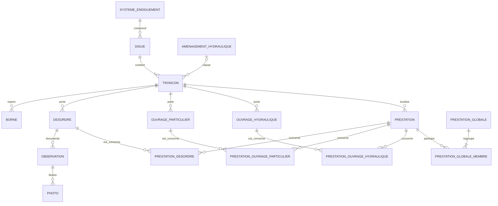
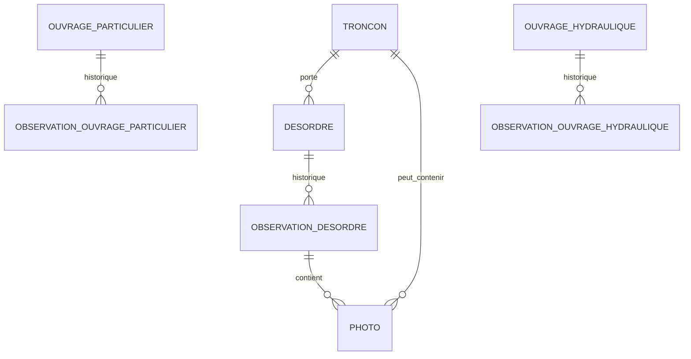
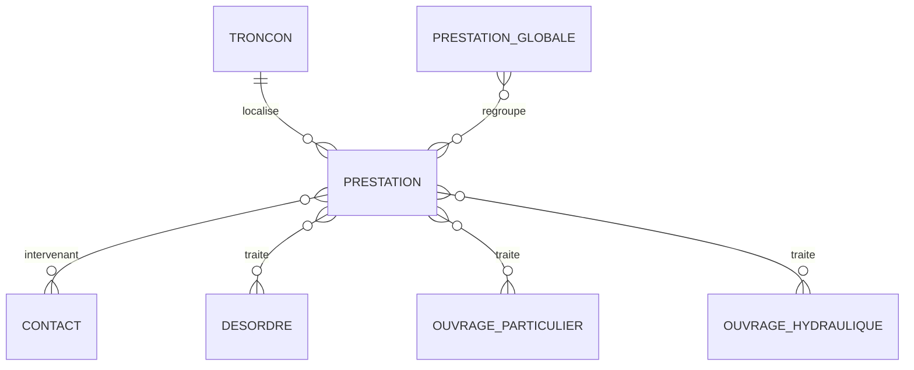

# SIRS — premier schéma conceptuel PostgreSQL/PostGIS

Version : **0.1 — 28 août 2026**  
Source : profil structurel du dump CouchDB complet (4 768 documents)

## Objet de cette version

Ce document propose le premier noyau relationnel du futur SIRS. Il ne cherche pas encore à reproduire les 140 classes CouchDB ni tous leurs champs. Il fixe d'abord :

- la structure du patrimoine ;
- la chaîne désordre → observation → photo ;
- les ouvrages rattachés aux tronçons ;
- les prestations simples et globales ;
- les relations plusieurs-à-plusieurs qui doivent remplacer les listes d'identifiants dupliquées de CouchDB ;
- la place des référentiels et de la traçabilité de migration.

Les cardinalités ci-dessous décrivent le modèle proposé. Elles devront être confrontées au code Java et à quelques cas métier avant la production du SQL définitif.

## Vue d'ensemble



Lecture simple :

- un système d'endiguement comprend zéro à plusieurs digues ;
- une digue contient un ou plusieurs tronçons ;
- un tronçon peut porter des désordres, des ouvrages et des prestations ;
- un désordre possède un historique d'observations ;
- une prestation peut concerner plusieurs désordres et plusieurs ouvrages ;
- une prestation globale regroupe une ou plusieurs prestations simples.

## 1. Patrimoine et localisation

| Table proposée | Rôle | Relations principales | Géométrie PostGIS envisagée |
|---|---|---|---|
| `systeme_endiguement` | Système d'endiguement réglementaire | parent de `digue` | facultative ou calculée |
| `amenagement_hydraulique` | Aménagement hydraulique / branche ZEC | peut classifier des tronçons | `geometry` ou `multi_polygon` à confirmer |
| `digue` | Ouvrage nommé regroupant des tronçons | appartient éventuellement à un système | facultative ou calculée |
| `troncon` | Unité linéaire de référence | appartient obligatoirement à une digue | `multi_line_string` |
| `borne` | Repère physique ou fictif | rattaché à un tronçon | `point` |
| `systeme_reperage` | Référentiel linéaire d'un tronçon | rattaché à un tronçon et à ses bornes | aucune géométrie propre nécessaire |

### Modèle provisoire pour les ZEC / aménagements hydrauliques

Le dump contient :

- 26 digues, dont 19 avec `systemeEndiguementId` ;
- 7 digues sans système d'endiguement ;
- 6 aménagements hydrauliques ;
- seulement 2 tronçons portant directement `amenagementHydrauliqueId`.

La version 0.1 conserve donc fidèlement les deux liens observés :

```text
digue.systeme_endiguement_id       nullable
troncon.amenagement_hydraulique_id nullable
troncon.digue_id                   obligatoire
```

Elle n'invente pas encore un lien `digue → amenagement_hydraulique`. Il faudra vérifier dans SIRS si les sept digues sans système représentent bien les ZEC, et comment leurs tronçons sont censés être rattachés à l'aménagement hydraulique.

## 2. Désordres, observations et photos



Le dump distingue plusieurs classes d'observations :

- 3 206 `Observation` sous des désordres ;
- 18 `ObservationOuvrageParticulier` ;
- 11 `ObservationOuvrageHydrauliqueAssocie` ;
- quelques observations spécialisées sur voies, accès et échelles limnimétriques.

Pour la première migration, il est plus sûr de conserver des tables d'observation spécialisées. Une table générique unique imposerait soit une référence polymorphe non contrôlée, soit un registre abstrait de tous les objets métier. Une unification pourra être étudiée ensuite si les champs et règles métier sont réellement communs.

Les 3 971 photos ne proviennent pas toutes d'une observation de désordre : certaines sont directement imbriquées dans des tronçons ou des ouvrages. La table `photo` devra donc être reliée à son parent par des liaisons explicites, avec la règle suivante :

> Une photo importée possède exactement un parent métier d'origine.

Cette règle devra être matérialisée soit par des tables de liaison spécialisées, soit par plusieurs clés étrangères nullable accompagnées d'une contrainte `CHECK`. La première solution est plus extensible ; la seconde est plus simple à interroger. Le choix reste ouvert en version 0.1.

## 3. Ouvrages

Le premier noyau conserve au minimum deux tables distinctes :

| Table | Documents du dump | Parent obligatoire | Observation propre |
|---|---:|---|---|
| `ouvrage_particulier` | 45 | `troncon` | oui |
| `ouvrage_hydraulique` | 26 | `troncon` | oui |

Les deux catégories possèdent des champs communs de localisation linéaire :

- tronçon ;
- système de repérage ;
- bornes de début et de fin ;
- distances aux bornes ;
- PR de début et de fin ;
- géométrie ;
- validité.

Ces champs pourront être factorisés dans la couche applicative ou dans une structure SQL commune ultérieure. La version 0.1 évite toutefois une table `ouvrage` générique tant que les autres classes (`ouvrage_franchissement`, voies, échelles, dépendances, végétation, etc.) n'ont pas été comparées.

## 4. Prestations et ajouts groupés



Dans le schéma physique, chaque relation plusieurs-à-plusieurs devient une table de liaison :

| Table de liaison | Clé primaire composée | Usage |
|---|---|---|
| `prestation_desordre` | `(prestation_id, desordre_id)` | plusieurs désordres ajoutés à une prestation en une seule opération |
| `prestation_ouvrage_particulier` | `(prestation_id, ouvrage_particulier_id)` | ouvrages particuliers concernés |
| `prestation_ouvrage_hydraulique` | `(prestation_id, ouvrage_hydraulique_id)` | ouvrages hydrauliques concernés |
| `prestation_globale_membre` | `(prestation_globale_id, prestation_id)` | plusieurs prestations simples ajoutées à une prestation globale |
| `prestation_intervenant` | `(prestation_id, contact_id)` | intervenants d'une prestation |
| `prestation_globale_intervenant` | `(prestation_globale_id, contact_id)` | intervenants portés par la prestation globale |

Ainsi, l'ajout groupé n'est pas un cas particulier du stockage : l'interface sélectionne plusieurs objets, puis insère plusieurs lignes dans la même table de liaison au sein d'une transaction.

Exemple logique :

```sql
BEGIN;

INSERT INTO prestation_desordre (prestation_id, desordre_id)
VALUES
    (:prestation, :desordre_1),
    (:prestation, :desordre_2),
    (:prestation, :desordre_3)
ON CONFLICT DO NOTHING;

COMMIT;
```

## 5. Colonnes communes proposées

Les tables métier principales devraient recevoir un socle commun, sans recopier mécaniquement tous les champs CouchDB :

| Colonne | Type provisoire | Rôle |
|---|---|---|
| `id` | `uuid` ou `text` | clé primaire ; le format réel de tous les `_id` doit être vérifié avant de choisir `uuid` |
| `couchdb_id` | `text` unique | identifiant historique si `id` devient une nouvelle clé PostgreSQL |
| `couchdb_rev_importee` | `text` | trace de la révision au moment de la migration, sans rôle fonctionnel futur |
| `valide` | `boolean` | conservation des objets invalidés/archivés |
| `cree_le` | `timestamptz` | si une date de création fiable existe |
| `modifie_le` | `timestamptz` | conversion de `dateMaj` |
| `auteur_id` | clé étrangère | auteur initial, lorsque connu |
| `dernier_auteur_id` | clé étrangère | conversion de `lastUpdateAuthor` |
| `donnees_source` | `jsonb` facultatif | copie temporaire du document source pour audit de migration |

`couchdb_rev_importee` et `donnees_source` sont des aides à la migration. Ils ne remplacent pas un futur mécanisme d'historisation PostgreSQL.

## 6. Référentiels

Le dump contient de nombreuses classes `Ref…`. La première proposition est :

- une table dédiée lorsque le référentiel porte des attributs ou des règles spécifiques ;
- éventuellement une structure commune pour les petits référentiels limités à `id`, `libelle`, ordre et validité ;
- des clés étrangères depuis les tables métier, jamais de libellés libres recopiés lorsque la référence existe.

Référentiels prioritaires du noyau :

```text
ref_type_desordre
ref_categorie_desordre
ref_urgence
ref_suite_apporter
ref_position
ref_cote
ref_source
ref_type_prestation
ref_type_ouvrage_particulier
ref_type_ouvrage_hydraulique
ref_statut_horodatage
```

Il est trop tôt pour décider si tous doivent être des tables séparées ou des lignes typées dans une table générique. Ce choix devra tenir compte de QGIS : des tables séparées donnent des listes de valeurs et des contraintes plus explicites.

## 7. Intégrité et réconciliation à la migration

Les associations CouchDB réciproques ne seront jamais copiées deux fois. Pour chaque relation, la migration construit une table de liaison canonique.

| Relation | Paires concordantes | Uniquement côté prestation | Uniquement côté objet |
|---|---:|---:|---:|
| Prestation ↔ Désordre | 1 218 | 72 | 30 |
| Prestation ↔ Prestation globale | 1 450 | 51 | 24 |
| Prestation ↔ Ouvrage particulier | 344 | 22 | 7 |
| Prestation ↔ Ouvrage hydraulique | 24 | 0 | 0 |

Règle provisoire recommandée :

1. importer automatiquement les paires présentes des deux côtés ;
2. placer les paires unilatérales dans une table de contrôle de migration ;
3. ne les intégrer au modèle canonique qu'après règle métier ou validation manuelle ;
4. conserver la provenance de la décision dans un journal d'import.

Cette prudence évite de perdre des liens potentiellement valides tout en empêchant une incohérence historique de devenir une vérité relationnelle.

## 8. Contraintes principales envisagées

- toutes les clés étrangères structurantes sont contrôlées par PostgreSQL ;
- suppression physique interdite pour les objets métier déjà référencés ;
- archivage par `valide = false` ou statut explicite ;
- unicité sur chaque paire d'une table de liaison ;
- `date_fin >= date_debut` lorsque les deux dates sont connues ;
- géométries valides et SRID unique à déterminer ;
- index GiST sur les géométries ;
- index B-tree sur les clés étrangères et dates de consultation fréquente ;
- transaction unique pour les ajouts groupés ;
- aucune utilisation de tableaux d'identifiants pour représenter les relations métier.

## 9. Périmètre encore hors version 0.1

Les éléments suivants sont bien présents dans le dump mais devront rejoindre une version ultérieure du schéma :

- végétation : arbres, parcelles, peuplements, invasives et traitements ;
- voies de digue et voies d'accès ;
- dépendances et désordres de dépendances ;
- ouvrages de franchissement, déversoirs, échelles limnimétriques, stations de pompage ;
- organismes, contacts et gestionnaires au-delà des liens d'intervenants ;
- rapports d'étude, documents et pièces jointes ;
- obligations réglementaires ;
- utilisateurs, droits et journal d'audit ;
- historique métier complet des modifications.

## 10. Décisions à valider avant le SQL v0.2

1. Les sept digues sans système d'endiguement correspondent-elles toutes à des ZEC/aménagements hydrauliques ?
2. Une prestation simple peut-elle officiellement appartenir à plusieurs prestations globales, ou est-ce une possibilité seulement technique/historique ?
3. Une prestation globale doit-elle obligatoirement regrouper des prestations d'un même système, d'une même digue ou d'un même tronçon ?
4. Les objets `valid = false` doivent-ils rester consultables comme archives dans l'application cible ?
5. Les liens unilatéraux prestation ↔ objet doivent-ils être conservés par union, par intersection, ou validés au cas par cas ?
6. Quel est le système de coordonnées des géométries du dump et quel SRID doit devenir la référence PostGIS ?
7. Les photographies doivent-elles rester dans la base, dans un stockage de fichiers, ou dans un stockage objet avec seulement les métadonnées en PostgreSQL ?
8. Faut-il conserver les identifiants CouchDB comme clés primaires ou générer de nouveaux UUID tout en gardant `couchdb_id` unique ?

## Conclusion de la version 0.1

Le noyau relationnel est suffisamment clair pour être construit sans reproduire la dette structurelle de CouchDB. La principale difficulté n'est pas la chaîne système → digue → tronçon → désordre, mais la réconciliation des associations réciproques et la modélisation homogène des nombreuses familles d'ouvrages et d'observations.

La prochaine version devra transformer ce modèle conceptuel en :

- dictionnaire de tables et colonnes ;
- types PostgreSQL/PostGIS précis ;
- contraintes et index ;
- premier script `CREATE TABLE` ;
- règles de migration documentées et testables.
