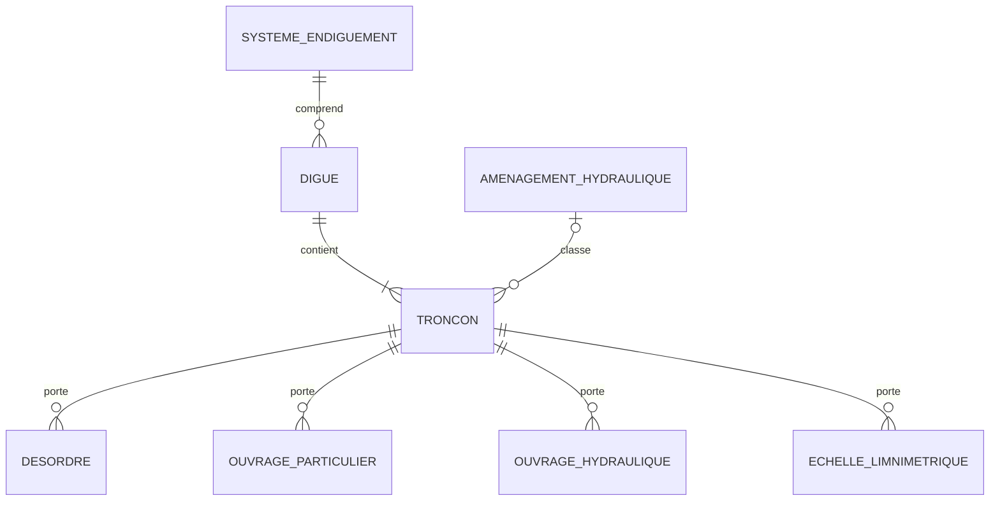
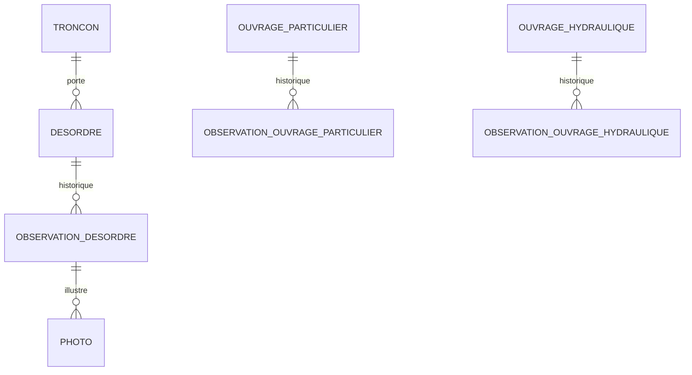
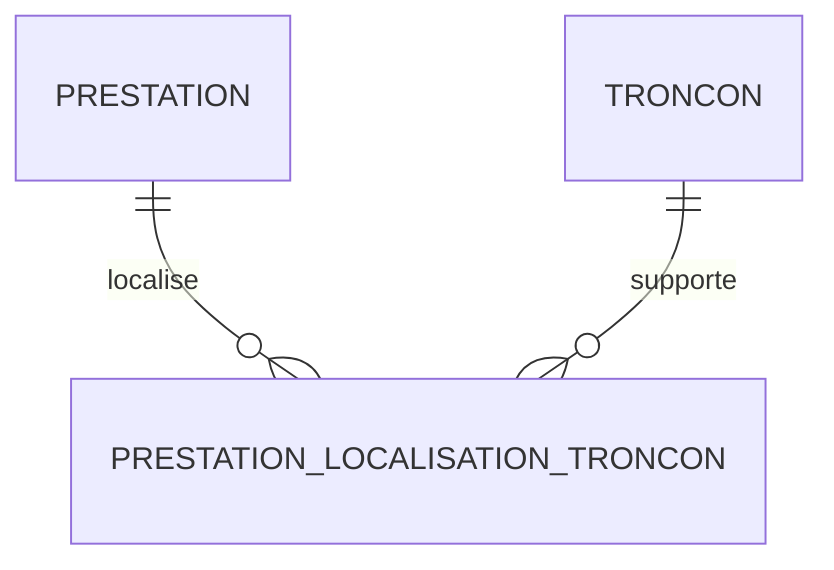
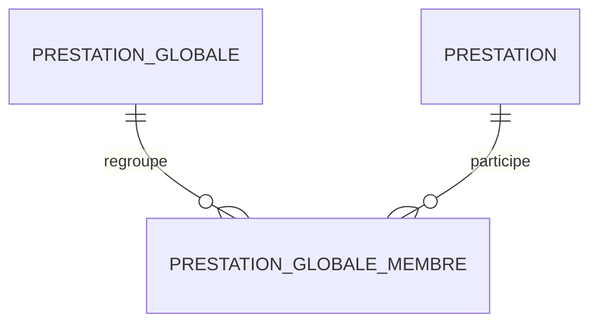
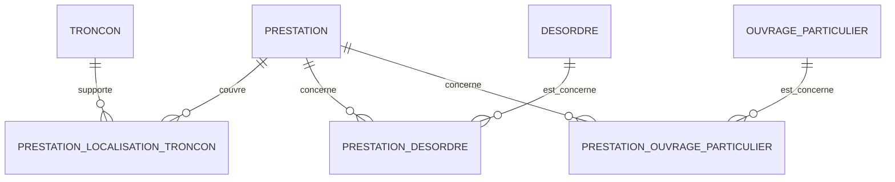
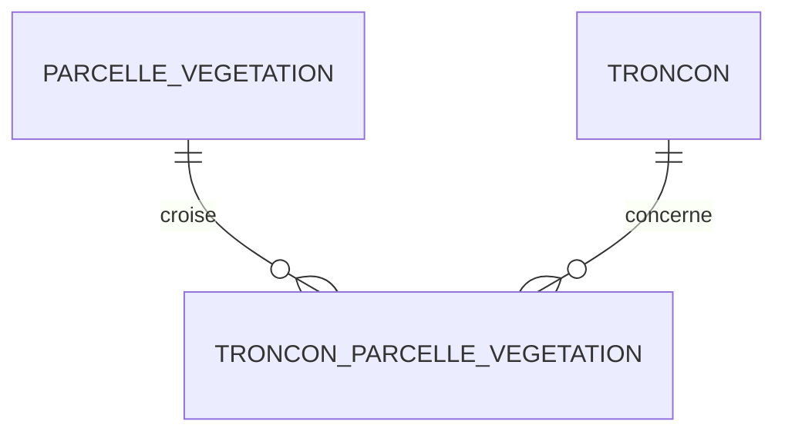
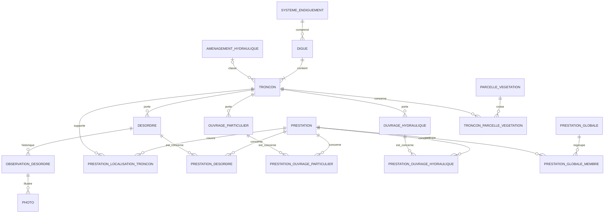

# SIRS — schéma conceptuel PostgreSQL/PostGIS

Version : **0.2 — 28 août 2026**  
Source : schéma conceptuel v0.1 + profil structurel du dump CouchDB complet (4 768 documents)

## Objet de cette version

Cette version corrige le modèle de localisation de la v0.1.

Le référencement linéaire historique de SIRS v2 ne doit pas être interprété comme une mesure terrain autonome à préserver systématiquement. Pour les objets réellement géolocalisés, la géométrie constitue la source spatiale de référence. Le référencement par bornes, PR et distances devient alors une donnée dérivée ou une donnée de migration.

Une exception importante subsiste : certaines prestations ont une logique métier intrinsèquement linéaire et peuvent être décrites plus proprement par un intervalle le long d'un tronçon que par une géométrie saisie manuellement.

La version 0.2 fixe donc le principe suivant :

```text
objets physiques géolocalisés
→ troncon_id + geometry

prestations linéaires
→ troncon_id + debut_m + fin_m
→ géométrie calculable
```

Elle ne produit pas encore le SQL définitif.

---

## 1. Principe général de localisation

### 1.1 Objets physiques géolocalisés

Pour les objets cartographiés dont la position provient d'un GPS, d'une saisie cartographique ou d'une géométrie source, la donnée spatiale de référence devient la géométrie PostGIS.

Sont concernés en priorité :

- désordres ;
- ouvrages particuliers ;
- ouvrages hydrauliques ;
- échelles limnimétriques ;
- ouvrages de franchissement ;
- voies et accès lorsqu'une géométrie propre existe ;
- observations géolocalisées ;
- photos géolocalisées ;
- autres objets physiques cartographiés.

Modèle cible minimal :

```text
troncon_id
geometry
```

Le rattachement au tronçon reste une relation métier explicite lorsque ce rattachement a du sens. Il ne remplace pas la géométrie et n'est pas déduit automatiquement à chaque lecture.

### 1.2 Données linéaires héritées devenant dérivées

Pour les objets géolocalisés, les champs CouchDB suivants ne doivent plus constituer un second système de localisation permanent :

```text
systemeRepId
borneDebutId
borneFinId
borne_debut_distance
borne_fin_distance
borne_debut_aval
borne_fin_aval
prDebut
prFin
positionDebut
positionFin
approximatePositionDebut
approximatePositionFin
```

Ils peuvent être :

- utilisés pendant la migration pour contrôle ;
- conservés temporairement dans une zone d'audit ;
- recalculés à la demande à partir de la géométrie et du tronçon ;
- non migrés dans les tables métier finales lorsqu'ils n'ont pas de valeur autonome.

La v0.2 ne propose donc plus `borne` et `systeme_reperage` comme dépendances obligatoires de tous les objets cartographiques.

---

## 2. Patrimoine



| Table proposée | Rôle | Localisation de référence |
|---|---|---|
| `systeme_endiguement` | système réglementaire | géométrie facultative ou calculée |
| `amenagement_hydraulique` | ZEC / aménagement hydraulique | géométrie à confirmer |
| `digue` | ouvrage nommé regroupant des tronçons | géométrie facultative ou calculée |
| `troncon` | unité linéaire de référence | géométrie linéaire PostGIS |
| `desordre` | désordre géolocalisé | `troncon_id + geometry` |
| `ouvrage_particulier` | ouvrage ponctuel/linéaire selon type | `troncon_id + geometry` |
| `ouvrage_hydraulique` | ouvrage hydraulique | `troncon_id + geometry` |
| `echelle_limnimetrique` | équipement physique | `troncon_id + geometry` |

Les bornes physiques peuvent être conservées comme objets patrimoniaux si elles ont une existence métier propre, mais elles ne structurent plus la localisation de tous les objets.

---

## 3. Désordres, observations et photos



### Désordre

Le désordre ne doit plus maintenir simultanément :

```text
geometry
+ systemeRepId
+ borneDebutId / borneFinId
+ distances
+ PR
+ positions projetées
```

Le modèle cible est :

```text
desordre
- id
- troncon_id
- geometry
- attributs métier
- traçabilité
```

Si un PR ou une distance le long du tronçon est utile à l'affichage ou à un rapport, il peut être calculé à partir de la géométrie.

### Observations

Les observations restent rattachées à leur objet parent. Une géométrie propre n'est nécessaire que lorsqu'une observation est réellement localisée indépendamment du parent.

### Photos

La localisation linéaire héritée d'une photo ne doit pas être considérée comme la référence spatiale si la photo est déjà rattachée à un objet ou possède une géométrie/coordonnée propre.

Le principe "une photo importée possède exactement un parent métier d'origine" est conservé.

---

## 4. Prestations : distinction entre objet métier et localisation linéaire

Le dump contient 1 552 `Prestation`. Le profil montre que les champs de référencement linéaire sont massivement présents : `borneDebutId` et `borneFinId` apparaissent dans 1 228 prestations, tandis que les distances aux bornes sont présentes sur l'ensemble des prestations. Cela confirme que le modèle historique de SIRS encode fortement la position le long d'un tronçon.

La v0.2 ne reprend toutefois pas cette structure telle quelle.

### 4.1 Prestation couvrant tout un tronçon

Cas :

```text
Débroussaillage du tronçon T12 entier
```

Modèle :

```text
prestation
- troncon_id
- localisation = troncon_entier
```

Il n'est pas nécessaire de stocker deux bornes ni deux PR.

Une représentation plus physique pourra utiliser :

```text
debut_m = 0
fin_m   = longueur du tronçon
```

mais ces valeurs peuvent aussi être dérivées.

### 4.2 Prestation couvrant une partie d'un tronçon

Cas :

```text
Débroussaillage
tronçon T12
debut_m = 20
fin_m   = longueur(T12) - 20
```

Ici, `debut_m` et `fin_m` ont une valeur métier propre.

Modèle conceptuel minimal :

```text
prestation
- id
- troncon_id
- debut_m
- fin_m
- attributs métier
```

Contraintes conceptuelles :

```text
debut_m >= 0
fin_m >= debut_m
fin_m <= longueur du tronçon
```

La géométrie cartographique de la prestation est dérivée du tronçon par interpolation/substring PostGIS.

### 4.3 Géométrie dérivée

Une prestation linéaire ne nécessite pas nécessairement une géométrie éditable stockée.

Conceptuellement :

```text
geometry_prestation =
substring(
    geometry_troncon,
    debut_m / longueur_troncon,
    fin_m / longueur_troncon
)
```

La réalisation pourra être :

- une vue PostGIS ;
- une colonne générée si les dépendances le permettent ;
- une vue matérialisée ;
- un calcul dans QGIS.

La v0.2 ne tranche pas encore le mécanisme physique.

---

## 5. Prestation sur plusieurs tronçons

Une prestation globale ou une opération peut concerner plusieurs tronçons. Il faut éviter de forcer une seule paire `troncon_id + debut_m + fin_m` dans une table unique si l'objet métier couvre plusieurs segments.

Le modèle recommandé est de séparer :

```text
PRESTATION
    ↓
PRESTATION_LOCALISATION_TRONCON
    ↓
TRONCON
```



Table conceptuelle :

```text
prestation_localisation_troncon
- id
- prestation_id
- troncon_id
- debut_m
- fin_m
```

Cette structure permet :

- une prestation sur un tronçon entier ;
- une prestation sur une partie de tronçon ;
- une prestation sur plusieurs tronçons ;
- des intervalles différents pour chaque tronçon.

Pour une prestation qui couvre plusieurs tronçons entiers, les lignes de localisation peuvent simplement représenter chaque tronçon sans imposer de saisie manuelle des distances.

---

## 6. Prestation simple, prestation globale et membres

La relation entre `GlobalPrestation` et `Prestation` reste distincte de la localisation.



Le dump contient 124 prestations globales et 1 552 prestations simples. Les liens historiques sont bidirectionnels et présentent des incohérences résiduelles ; ils devront être réconciliés à la migration.

La v0.2 conserve donc une table canonique :

```text
prestation_globale_membre
- prestation_globale_id
- prestation_id
```

La localisation d'une prestation globale ne doit pas être dupliquée si elle peut être obtenue par union des localisations de ses prestations membres.

Deux cas doivent toutefois être distingués :

1. la prestation globale est uniquement un regroupement administratif de prestations simples ;
2. la prestation globale porte elle-même une emprise métier indépendante.

Le dump et le profil structurel ne suffisent pas à trancher ce point. Tant qu'il n'est pas validé, la v0.2 recommande de ne pas imposer de localisation propre à `prestation_globale`.

---

## 7. Prestations et objets ponctuels

Une prestation peut concerner simultanément des linéaires et des objets métier.

Exemples :

```text
prestation
→ tronçon T12 de 20 m à 450 m
→ désordre D1
→ désordre D2
→ ouvrage O3
```

Il ne faut pas fusionner ces deux notions.

La localisation linéaire est portée par :

```text
prestation_localisation_troncon
```

Les objets concernés sont portés par des tables de liaison :

```text
prestation_desordre
prestation_ouvrage_particulier
prestation_ouvrage_hydraulique
prestation_echelle_limnimetrique
...
```



Cette séparation évite d'utiliser les désordres ou ouvrages comme substituts de localisation.

---

## 8. Référencement linéaire : objets pour lesquels il reste pertinent

### À conserver comme donnée métier de référence

En première analyse :

- prestations linéaires ;
- éventuellement certains traitements de végétation définis explicitement par intervalle le long d'un tronçon ;
- éventuellement certaines voies, dépendances ou zones gérées si leur définition métier est linéaire et non issue d'une géométrie GPS.

### À supprimer comme système de référence primaire

En première analyse :

- désordres ;
- ouvrages particuliers ;
- ouvrages hydrauliques ;
- échelles limnimétriques ;
- photos ;
- observations localisées ;
- autres objets physiques dont la géométrie est la source réelle de position.

### À examiner au cas par cas

Le dump montre aussi des classes de végétation et de voies utilisant des PR, positions et/ou bornes. Leur présence dans CouchDB ne suffit pas à conclure que ces valeurs sont des données métier originales. Pour ces classes, il faut vérifier l'origine réelle de la localisation avant de décider.

---

## 9. Parcelles de végétation

La v0.1 plaçait la végétation hors périmètre. La v0.2 introduit néanmoins le principe relationnel nécessaire.

Une parcelle de végétation peut chevaucher plusieurs tronçons. Elle ne doit donc pas être dupliquée pour respecter une relation 1→N artificielle.

Modèle :



```text
parcelle_vegetation
- id
- geometry
- attributs métier

troncon_parcelle_vegetation
- parcelle_id
- troncon_id
```

La géométrie de la parcelle reste la référence spatiale. La relation avec les tronçons exprime l'appartenance métier ou le chevauchement utile à la gestion.

---

## 10. Champs CouchDB devenant dérivés ou transitoires

### Généralement non migrés comme colonnes métier permanentes

```text
systemeRepId
borneDebutId
borneFinId
borne_debut_distance
borne_fin_distance
borne_debut_aval
borne_fin_aval
prDebut
prFin
positionDebut
positionFin
approximatePositionDebut
approximatePositionFin
```

### Exception

Pour une prestation dont le métier est réellement défini par un intervalle le long d'un tronçon, la migration doit convertir le système historique vers :

```text
troncon_id
debut_m
fin_m
```

La conversion doit être validée géométriquement avant suppression des valeurs sources.

### Traçabilité de migration

Les valeurs CouchDB sources peuvent être conservées temporairement dans :

```text
donnees_source jsonb
```

ou dans des tables d'audit de migration, sans devenir des colonnes fonctionnelles du nouveau modèle.

---

## 11. Vue d'ensemble v0.2



---

## 12. Décisions reportées avant SQL définitif

1. Déterminer le SRID de référence PostGIS.
2. Valider si une prestation simple peut appartenir à plusieurs prestations globales ou si le N↔N historique est seulement une possibilité technique.
3. Déterminer si `GlobalPrestation` possède une emprise indépendante ou si sa localisation doit être calculée à partir de ses membres.
4. Définir précisément la convention d'origine de `debut_m` / `fin_m` : origine géométrique du tronçon, sens métier amont→aval, ou autre règle stable.
5. Définir le comportement lorsqu'un tronçon est redécoupé, inversé ou remplacé.
6. Vérifier quelles classes de végétation, voies et dépendances ont une localisation intrinsèquement linéaire.
7. Définir la stratégie de migration des valeurs historiques de PR/bornes vers `debut_m` / `fin_m`.
8. Conserver ou non les bornes physiques comme objets patrimoniaux indépendants.
9. Valider la gestion des prestations couvrant plusieurs tronçons entiers.
10. Définir les contrôles permettant de garantir que `fin_m` ne dépasse jamais la longueur du tronçon.

---

## Conclusion de la version 0.2

La localisation doit être adaptée à la nature de l'objet et non imposée par un modèle générique unique.

Le principe cible devient :

```text
objets physiques
→ géométrie PostGIS réelle

prestations linéaires
→ intervalle métier le long d'un tronçon

prestations multi-tronçons
→ plusieurs intervalles via une table de localisation

relations métier
→ clés étrangères et tables de liaison
```

Cette structure évite de reproduire dans PostgreSQL le système SIRS v2 où un même objet peut porter simultanément géométrie, bornes, distances, PR et positions projetées.

La prochaine étape devra produire un dictionnaire de données précis pour `troncon`, `prestation`, `prestation_localisation_troncon`, `prestation_globale` et les principales tables de liaison, puis définir les règles de migration sans encore supprimer les données sources nécessaires au contrôle.
