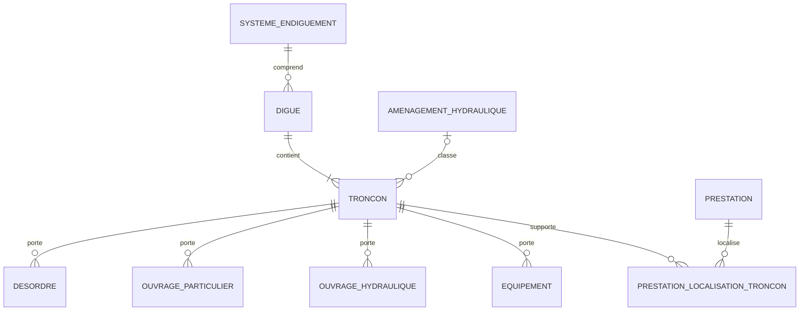
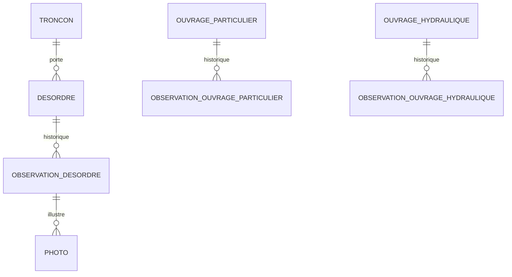
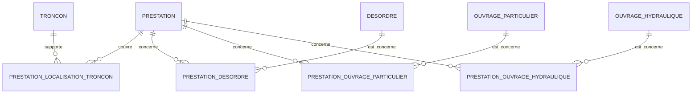
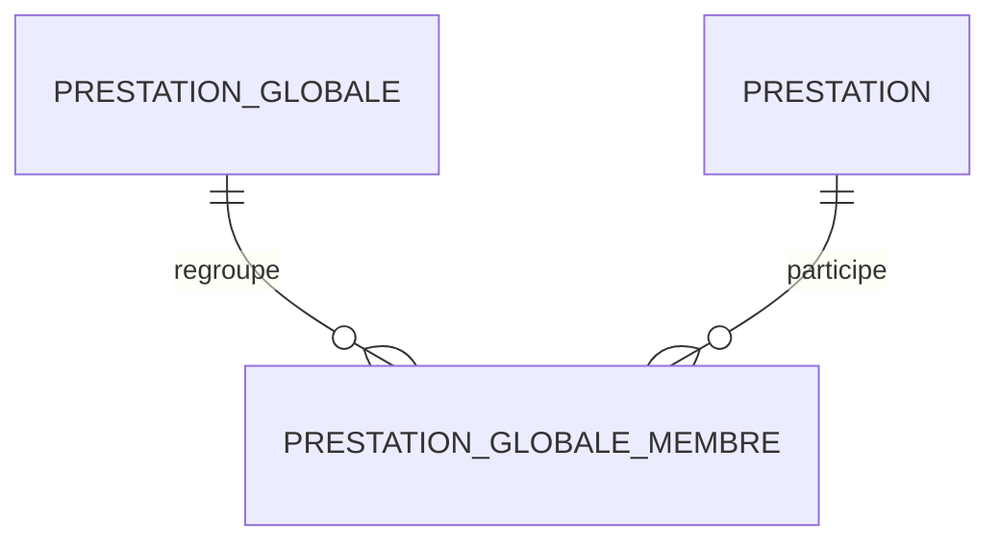
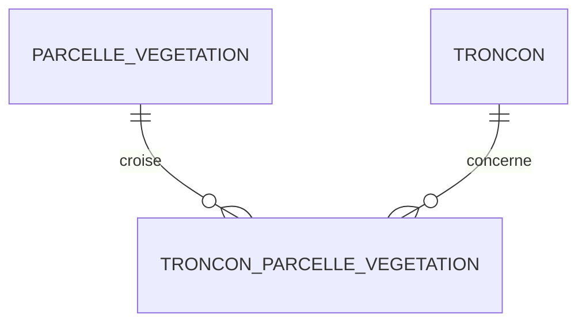
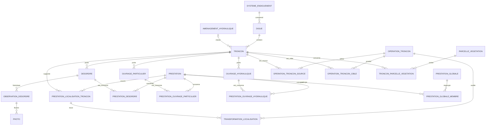

# SIRS — schéma conceptuel PostgreSQL/PostGIS

Version : **0.3 — 28 août 2026**  
Source : schéma conceptuel v0.2 + profil structurel du dump CouchDB complet (4 768 documents)

## Objet de cette version

Cette version formalise le comportement des prestations linéaires lorsque le référentiel de tronçons évolue.

La décision d'architecture désormais acquise est la suivante :

> Pour une prestation linéaire, le rattachement au tronçon et `debut_m` / `fin_m` constituent la localisation métier de référence. La géométrie cartographique est dérivée du tronçon courant et doit être recalculée automatiquement lorsque le référentiel de tronçons évolue.

Le modèle cible distingue donc clairement :

```text
objets physiques géolocalisés
→ troncon_id + geometry PostGIS de référence

prestations linéaires
→ prestation_localisation_troncon
→ troncon_id + debut_m + fin_m
→ géométrie dérivée, non éditable indépendamment
```

Cette version :

- confirme que la prestation ne possède pas de `geometry_realisation` historique figée ;
- définit le recalcul après correction géométrique d'un tronçon ;
- définit la transformation conceptuelle après inversion ;
- formalise le redécoupage et la fusion comme opérations métier transactionnelles ;
- introduit une représentation stable du cas « tronçon entier » ;
- rend les transformations de tronçons détectables et auditables ;
- prépare le futur dictionnaire physique sans produire encore le SQL définitif.

---

## 1. Principe général de localisation

### 1.1 Objets physiques géolocalisés

Pour les objets cartographiés dont la position provient d'un GPS, d'une saisie cartographique ou d'une géométrie source, la donnée spatiale de référence reste la géométrie PostGIS.

Sont concernés en priorité :

- désordres ;
- ouvrages particuliers ;
- ouvrages hydrauliques ;
- équipements, dont les échelles limnimétriques et ouvrages de franchissement ;
- voies et accès lorsqu'une géométrie propre existe ;
- observations possédant une géométrie propre ;
- photos possédant une géométrie ou des coordonnées propres ;
- autres objets physiques cartographiés.

Modèle cible minimal :

```text
troncon_id
geometry
```

Le rattachement au tronçon reste une relation métier explicite lorsque ce rattachement a du sens. Il ne remplace pas la géométrie et n'est pas déduit automatiquement à chaque lecture.

### 1.2 Données linéaires historiques devenant dérivées ou transitoires

Pour les objets physiques géolocalisés, les champs CouchDB suivants ne doivent pas constituer un second système permanent de localisation :

```text
systemeRepId
borneDebutId
borneFinId
borne_debut_distance
borne_fin_distance
borne_debut_aval
borne_fin_aval
prDebut
prFin
positionDebut
positionFin
approximatePositionDebut
approximatePositionFin
```

Ils peuvent être :

- utilisés pendant la migration pour contrôle ;
- conservés temporairement dans une zone d'audit ;
- recalculés à la demande lorsqu'un affichage ou un rapport le nécessite ;
- non migrés dans les tables métier finales lorsqu'ils n'ont pas de valeur autonome.

Les bornes physiques peuvent subsister comme objets patrimoniaux si elles ont une existence métier propre. Elles ne redeviennent pas pour autant la source permanente de localisation des désordres, ouvrages, équipements, photos ou observations géolocalisées.

### 1.3 Exception métier : prestations linéaires

Certaines prestations, par exemple le débroussaillage d'un linéaire, sont définies par une portion de tronçon plutôt que par une géométrie relevée au GPS.

Leur localisation de référence est portée exclusivement par :

```text
prestation_localisation_troncon
- prestation_id
- troncon_id
- troncon_entier
- debut_m
- fin_m
```

Une prestation peut avoir zéro, une ou plusieurs lignes de localisation.

---

## 2. Patrimoine



| Table proposée | Rôle | Localisation de référence |
|---|---|---|
| `systeme_endiguement` | système réglementaire | géométrie facultative ou calculée |
| `amenagement_hydraulique` | ZEC / aménagement hydraulique | géométrie à confirmer |
| `digue` | ouvrage nommé regroupant des tronçons | géométrie facultative ou calculée |
| `troncon` | unité linéaire du réseau de référence | géométrie linéaire PostGIS |
| `desordre` | désordre géolocalisé | `troncon_id + geometry` |
| `ouvrage_particulier` | ouvrage ponctuel ou linéaire selon son type | `troncon_id + geometry` |
| `ouvrage_hydraulique` | ouvrage hydraulique | `troncon_id + geometry` |
| `equipement` | équipement physique ; spécialisation à préciser | `troncon_id + geometry` |
| `prestation_localisation_troncon` | intervalle métier d'une prestation linéaire | `troncon_id + troncon_entier` ou `troncon_id + debut_m + fin_m` |

La branche exacte des sept digues sans système d'endiguement et des aménagements hydrauliques reste à confirmer. La v0.3 ne modifie pas cette partie de la v0.2.

---

## 3. Désordres, observations et photos



### Désordres et ouvrages

Un désordre ou un ouvrage ne doit plus maintenir simultanément une géométrie et l'ensemble des champs SIRS de bornes, distances, PR et positions projetées comme sources concurrentes.

Modèle cible :

```text
objet physique
- id
- troncon_id
- geometry
- attributs métier
- traçabilité
```

Si un PR ou une distance le long du tronçon est utile à l'affichage ou à un rapport, il peut être calculé à partir de la géométrie de l'objet et du tronçon.

### Observations

Les observations restent rattachées à leur objet parent. Une géométrie propre n'est conservée que lorsqu'une observation est réellement localisée indépendamment de ce parent. Dans ce cas, cette géométrie est sa source spatiale de référence.

### Photos

Le principe « une photo importée possède exactement un parent métier d'origine » est conservé. Une photo peut en outre posséder une géométrie ou des coordonnées propres.

Les anciens champs de repérage linéaire d'une photo ne doivent pas devenir un second référentiel permanent.

---

## 4. Prestations : objet métier, emprise linéaire et objets concernés

Une prestation est un objet métier distinct de sa localisation. Elle peut :

- ne posséder aucune emprise linéaire ;
- couvrir tout ou partie d'un tronçon ;
- couvrir plusieurs tronçons ;
- être reliée indépendamment à des désordres, ouvrages ou équipements ;
- appartenir à une ou plusieurs prestations globales si cette cardinalité est confirmée.



Il ne faut pas confondre :

- l'emprise linéaire, portée par `prestation_localisation_troncon` ;
- les objets métier auxquels la prestation se rapporte, portés par les tables de liaison.

Exemple :

```text
prestation
→ tronçon T12 de 20 m à 450 m
→ désordre D1
→ désordre D2
→ ouvrage O3
```

La portion de T12 n'est pas déduite de D1, D2 ou O3. Réciproquement, associer D1 à la prestation ne signifie pas que la prestation couvre automatiquement la position de D1.

---

## 5. `prestation_localisation_troncon`

### 5.1 Structure conceptuelle

```text
prestation_localisation_troncon
- id technique éventuel
- prestation_id
- troncon_id
- troncon_entier
- debut_m
- fin_m
- données de traçabilité
```

Le besoin d'un identifiant technique distinct d'une clé composée sera décidé dans le dictionnaire physique. Il ne change pas le modèle métier.

Chaque ligne représente exactement une portion d'un tronçon pour une prestation donnée.

### 5.2 Portion de tronçon

Pour une portion de tronçon :

```text
troncon_entier = false
debut_m        = valeur obligatoire
fin_m          = valeur obligatoire
```

Contraintes conceptuelles :

```text
debut_m >= 0
fin_m >= debut_m
fin_m <= longueur du tronçon courant
```

La convention d'origine et de sens de mesure doit être unique et stable. Elle reste à préciser avant le dictionnaire physique.

### 5.3 Tronçon entier

Pour une prestation couvrant la totalité d'un tronçon :

```text
troncon_entier = true
debut_m        = NULL
fin_m          = NULL
```

Cette représentation est retenue de préférence à :

```text
debut_m = 0
fin_m = longueur_troncon
```

Elle évite de figer artificiellement l'ancienne longueur du tronçon. La règle métier devient :

> Tant que la ligne vise le même tronçon et que `troncon_entier = true`, la prestation couvre toujours le tronçon entier, quelle que soit une correction ultérieure de sa géométrie ou de sa longueur.

Une contrainte d'exclusivité devra garantir :

```text
troncon_entier = true
→ debut_m IS NULL AND fin_m IS NULL

troncon_entier = false
→ debut_m IS NOT NULL AND fin_m IS NOT NULL
```

### 5.4 Prestation sur plusieurs tronçons

Une prestation couvrant plusieurs tronçons possède plusieurs lignes de `prestation_localisation_troncon`.

Chaque ligne peut représenter :

- un tronçon entier ;
- une portion de tronçon ;
- l'une des portions produites par le redécoupage d'un ancien tronçon.

---

## 6. Géométrie dérivée des prestations

### 6.1 Règle de référence

La table `prestation_localisation_troncon` ne porte aucune géométrie métier éditable.

La géométrie affichée résulte de :

```text
troncon.geometry
+ prestation_localisation_troncon.troncon_entier
+ prestation_localisation_troncon.debut_m
+ prestation_localisation_troncon.fin_m
→ géométrie de prestation calculée
```

Pour une portion de tronçon, le principe conceptuel est :

```text
geometry_prestation =
substring(
    geometry_troncon,
    debut_m / longueur_troncon,
    fin_m / longueur_troncon
)
```

Pour `troncon_entier = true`, la géométrie dérivée est la géométrie complète du tronçon courant.

Cette formule illustre le principe ; elle ne constitue pas encore l'algorithme PostGIS définitif. Le futur calcul devra notamment respecter le SRID, le type géométrique et la convention de mesure retenue.

### 6.2 Absence de géométrie historique figée

Le modèle cible n'introduit pas de `geometry_realisation` figée pour les prestations linéaires.

Une correction ultérieure du tracé du tronçon entraîne donc une nouvelle représentation cartographique de la prestation. Par défaut, l'ancienne emprise géométrique n'est pas conservée comme géométrie métier historique.

La traçabilité d'une transformation du réseau peut conserver les métadonnées de l'opération, les anciennes valeurs de localisation et, si nécessaire pour l'audit technique, un état du tronçon. Cet audit ne devient pas une seconde géométrie fonctionnelle de prestation.

### 6.3 Exposition dans PostgreSQL et QGIS

La géométrie dérivée peut être exposée par :

- une vue SQL/PostGIS ;
- une fonction PostGIS ;
- une vue matérialisée avec mécanisme explicite de rafraîchissement ;
- une logique QGIS consommant les données de référence.

Le choix physique reste à faire, mais les exigences suivantes sont acquises :

- le calcul canonique repose sur le tronçon courant et les intervalles stockés ;
- QGIS ne doit pas éditer cette géométrie comme une source indépendante ;
- une modification du tronçon doit rendre la représentation recalculée disponible automatiquement ;
- si une vue matérialisée est choisie pour les performances, son rafraîchissement fait partie de la transaction ou du processus contrôlé de modification du réseau ;
- aucune géométrie dérivée obsolète ne doit être présentée silencieusement comme la vérité métier.

Une vue PostGIS non matérialisée constitue l'option conceptuellement la plus directe ; la décision de performance appartient à l'étape physique.

---

## 7. Recalcul des prestations linéaires

### 7.1 Correction géométrique sans changement conceptuel

Cas : le tracé d'un tronçon est légèrement corrigé, mais le tronçon demeure le même objet métier, avec le même sens.

```text
ancien tracé
→ nouveau tracé légèrement corrigé
```

Les valeurs suivantes sont conservées :

```text
troncon_id
troncon_entier
debut_m
fin_m
```

La géométrie de la prestation est recalculée automatiquement sur la nouvelle géométrie du tronçon.

Si la correction réduit la longueur au point de rendre un intervalle invalide, le système ne doit ni tronquer ni déplacer silencieusement cet intervalle. La modification du tronçon doit être refusée ou soumise à une opération contrôlée résolvant explicitement les dépendances concernées.

### 7.2 Inversion du sens d'un tronçon

Une inversion ne doit pas changer la portion physique représentée par une prestation.

Pour un ancien tronçon de longueur `L` :

```text
nouveau_debut_m = L - ancien_fin_m
nouveau_fin_m   = L - ancien_debut_m
```

Exemple :

```text
L = 1000 m

avant :
100 → 600

après inversion :
400 → 900
```

Pour une ligne `troncon_entier = true`, aucune distance n'est créée : le tronçon entier reste le tronçon entier.

L'inversion est une opération contrôlée qui doit, dans une même transaction :

1. identifier toutes les localisations dépendantes ;
2. mémoriser la longueur et les valeurs antérieures nécessaires à l'audit ;
3. inverser la géométrie et le sens du tronçon ;
4. transformer tous les intervalles partiels selon la formule ci-dessus ;
5. vérifier les contraintes ;
6. enregistrer l'opération et ses effets ;
7. rendre disponible la géométrie dérivée recalculée.

L'inversion ne doit pas pouvoir être effectuée comme une simple édition libre de la géométrie dans QGIS.

### 7.3 Redécoupage d'un tronçon

Le redécoupage remplace un tronçon conceptuel par plusieurs tronçons. Une ligne de localisation peut alors devenir plusieurs lignes.

Exemple :

```text
T1 : 0 → 1000 m

devient :

T1a : 0 → 450 m
T1b : 0 → 550 m
```

Une prestation initiale :

```text
T1 : 300 → 700
```

devient :

```text
T1a : 300 → 450
T1b :   0 → 250
```

La ligne d'origine ne doit pas être simplement modifiée ou supprimée sans trace. L'opération doit :

1. connaître l'ordre, le sens et les limites des tronçons cibles ;
2. rechercher toutes les intersections entre chaque intervalle source et les nouveaux tronçons ;
3. créer une ou plusieurs lignes cibles couvrant exactement la même portion physique ;
4. traiter explicitement le cas `troncon_entier = true` ;
5. vérifier qu'aucune portion source n'a été perdue ;
6. archiver ou remplacer la ligne source avec une trace de transformation ;
7. valider l'ensemble dans une transaction unique.

Pour une prestation couvrant l'ancien tronçon entier, le résultat attendu est normalement une ligne `troncon_entier = true` pour chacun des tronçons qui reconstituent exactement l'ancien tronçon. Les cas de recouvrement incomplet, de changement d'emprise ou d'ambiguïté nécessitent une validation explicite.

Le redécoupage ne doit jamais conduire à perdre silencieusement une localisation.

### 7.4 Fusion de tronçons

La fusion est la transformation inverse : plusieurs tronçons sources deviennent un nouveau tronçon.

Exemple :

```text
T1 : 300 → 450
T2 :   0 → 250
```

Ces deux localisations peuvent éventuellement devenir un intervalle unique sur le tronçon fusionné si :

- les tronçons sources sont géométriquement continus ;
- leur ordre est déterminé ;
- leurs sens sont compatibles ou ont été transformés explicitement ;
- les deux intervalles sont eux-mêmes contigus dans le nouveau repère ;
- aucun vide ni recouvrement ambigu n'est introduit.

Si ces conditions ne sont pas démontrées, les localisations ne doivent pas être fusionnées silencieusement. Elles peuvent rester représentées par plusieurs lignes sur le nouveau tronçon, sous réserve que le futur dictionnaire physique autorise et contraigne correctement ce cas.

La formule exacte de conversion vers les nouvelles abscisses sera définie avec l'algorithme de fusion. La v0.3 fixe seulement l'exigence de continuité, de conservation de l'emprise et d'audit transactionnel.

### 7.5 Remplacement d'un tronçon

Un remplacement diffère d'une simple correction géométrique : l'identité métier du tronçon change.

Il doit donc :

- désigner explicitement le tronçon source et le ou les tronçons cibles ;
- définir une correspondance permettant de transformer les localisations ;
- traiter toutes les dépendances avant d'archiver le tronçon source ;
- échouer si une dépendance ne peut pas être reportée sans ambiguïté ;
- conserver une trace de la décision.

Le remplacement ne doit pas être simulé par la suppression du tronçon source suivie de la création indépendante d'un nouveau tronçon.

---

## 8. Cycle de vie des tronçons

### 8.1 Deux catégories de modification

Une distinction est désormais obligatoire.

| Catégorie | Exemples | Effet sur les localisations linéaires |
|---|---|---|
| Correction du même tronçon | déplacement léger de sommets, amélioration du tracé, correction topologique sans changement de sens | conserver les intervalles et recalculer la géométrie dérivée, sous réserve de validité |
| Transformation du référentiel | inversion, redécoupage, fusion, remplacement | transformer explicitement les dépendances dans une opération transactionnelle et auditée |

Une inversion n'est donc pas une simple correction géométrique, même si elle peut techniquement être réalisée en inversant l'ordre des sommets.

### 8.2 Opération contrôlée et auditable

Le modèle relationnel doit rendre chaque transformation détectable. Conceptuellement, une opération de tronçon doit enregistrer au minimum :

```text
operation_troncon
- identifiant
- type : inversion | redecoupage | fusion | remplacement
- auteur
- date
- statut
- justification ou commentaire
- tronçon(s) source(s)
- tronçon(s) cible(s)
- résultat de validation
```

La forme physique pourra utiliser une table d'opération et des tables de liaison source/cible. Elle sera précisée au dictionnaire des données.

L'audit doit permettre d'établir :

- quelles localisations existaient avant l'opération ;
- quelles localisations les ont remplacées ;
- selon quelle transformation ;
- si toutes les dépendances ont été traitées ;
- qui a validé l'opération et quand.

### 8.3 Transaction et verrouillage

Une transformation du référentiel doit être atomique :

```text
modification du ou des tronçons
+ transformation des localisations dépendantes
+ contrôles de conservation
+ écriture de l'audit
+ actualisation de la représentation dérivée
= une seule opération validée ou aucun changement
```

Le mécanisme physique de verrouillage sera défini ultérieurement. L'exigence conceptuelle est d'empêcher qu'une prestation soit lue ou modifiée au milieu d'un redécoupage partiellement appliqué.

### 8.4 Suppression et archivage

Un tronçon référencé par une donnée métier ne peut pas être supprimé sans traitement explicite de ses dépendances.

Le modèle physique devra utiliser des clés étrangères restrictives et/ou une procédure contrôlée. Une suppression en cascade de `prestation_localisation_troncon` est exclue, car elle ferait disparaître silencieusement la localisation des prestations.

Lors d'un redécoupage, d'une fusion ou d'un remplacement, le tronçon source doit normalement être archivé ou marqué comme remplacé après création et validation des correspondances. La politique détaillée d'archivage reste à définir.

### 8.5 Éditions depuis QGIS

QGIS reste l'environnement cartographique principal, mais les transformations structurantes ne doivent pas être réalisables par une simple édition directe non contrôlée de la couche `troncon`.

L'interface cible devra distinguer :

- la correction autorisée de la géométrie du même tronçon ;
- les commandes contrôlées d'inversion, redécoupage, fusion et remplacement.

Les modalités d'interface, de droits et de validation restent hors du schéma conceptuel.

---

## 9. Prestations simples, prestations globales et membres

La relation entre `GlobalPrestation` et `Prestation` reste distincte de la localisation.



Le dump contient 124 prestations globales et 1 552 prestations simples. Les liens historiques sont bidirectionnels et présentent des incohérences résiduelles ; ils devront être réconciliés à la migration dans une table canonique :

```text
prestation_globale_membre
- prestation_globale_id
- prestation_id
```

La localisation d'une prestation globale ne doit pas être dupliquée si elle peut être obtenue par union des localisations de ses membres.

Deux cas restent à distinguer :

1. la prestation globale est uniquement un regroupement administratif de prestations simples ;
2. la prestation globale porte elle-même une emprise métier indépendante.

Ce point demeure à valider. La v0.3 n'impose pas de localisation propre à `prestation_globale`.

---

## 10. Référencement linéaire : périmètre

### À conserver comme donnée métier de référence

- prestations linéaires ;
- éventuellement certains traitements de végétation explicitement définis par intervalle le long d'un tronçon ;
- éventuellement certaines voies, dépendances ou zones gérées si leur définition métier est linéaire et non issue d'une géométrie GPS.

### À exclure comme second système permanent de localisation

- désordres ;
- ouvrages particuliers ;
- ouvrages hydrauliques ;
- équipements ;
- photos possédant une géométrie propre ou rattachées à un objet parent ;
- observations localisées ;
- autres objets physiques dont la géométrie est la source réelle de position.

### À examiner au cas par cas

Le dump montre des classes de végétation, de voies et de dépendances utilisant des PR, positions ou bornes. Leur présence dans CouchDB ne suffit pas à conclure que ces valeurs sont des données métier originales. L'origine réelle de leur localisation doit être vérifiée avant décision.

---

## 11. Parcelles de végétation

Une parcelle de végétation peut chevaucher plusieurs tronçons. Elle ne doit pas être dupliquée pour respecter une relation 1→N artificielle.



```text
parcelle_vegetation
- id
- geometry
- attributs métier

troncon_parcelle_vegetation
- parcelle_id
- troncon_id
```

La géométrie de la parcelle reste la référence spatiale. La relation avec les tronçons exprime l'appartenance métier ou le chevauchement utile à la gestion.

---

## 12. Migration depuis CouchDB

### 12.1 Champs devenant dérivés ou transitoires

Pour les objets physiques géolocalisés, les champs suivants ne sont généralement pas migrés comme colonnes métier permanentes :

```text
systemeRepId
borneDebutId
borneFinId
borne_debut_distance
borne_fin_distance
borne_debut_aval
borne_fin_aval
prDebut
prFin
positionDebut
positionFin
approximatePositionDebut
approximatePositionFin
```

### 12.2 Conversion des prestations linéaires

Pour une prestation réellement définie par un intervalle, la migration doit convertir le système historique vers :

```text
prestation_id
troncon_id
troncon_entier
debut_m
fin_m
```

La conversion doit être validée géométriquement avant l'abandon des valeurs sources.

Le cas `troncon_entier = true` doit être détecté à partir des données sources selon une règle de migration explicite. La v0.3 ne fixe pas encore le seuil ou le critère permettant de conclure qu'une prestation historique couvrait réellement tout le tronçon.

### 12.3 Traçabilité de migration

Les valeurs CouchDB sources peuvent être conservées temporairement dans :

```text
donnees_source jsonb
```

ou dans des tables d'audit de migration, sans devenir des colonnes fonctionnelles du nouveau modèle.

Les relations réciproques incohérentes de CouchDB restent soumises aux règles de réconciliation définies dans la v0.1 : les paires concordantes sont importables automatiquement et les paires unilatérales doivent être contrôlées selon une règle métier documentée.

---

## 13. Vue d'ensemble v0.3



Le diagramme représente l'audit conceptuel des transformations. La forme exacte des tables `operation_troncon_*` et `transformation_localisation` sera arrêtée dans le dictionnaire physique.

---

## 14. Décisions désormais acquises

1. La localisation métier d'une prestation linéaire réside dans `prestation_localisation_troncon`.
2. `troncon_id`, `debut_m` et `fin_m` sont les données de référence d'une portion de tronçon.
3. `troncon_entier = true` avec `debut_m` et `fin_m` nuls représente durablement la totalité du tronçon courant.
4. La géométrie cartographique d'une prestation est dérivée et non éditable indépendamment.
5. Aucune `geometry_realisation` figée n'est introduite dans le modèle cible.
6. Une correction géométrique du même tronçon conserve les intervalles et déclenche le recalcul.
7. Une inversion transforme transactionnellement les intervalles avec `L - ancien_fin_m` et `L - ancien_debut_m`.
8. Un redécoupage peut transformer une ligne de localisation en plusieurs lignes sans perte silencieuse.
9. Une fusion ne regroupe des intervalles que si la continuité, l'ordre et le sens le permettent.
10. Inversion, redécoupage, fusion et remplacement sont des opérations contrôlées et auditables, pas de simples éditions géométriques.
11. Un tronçon référencé ne peut pas être supprimé avec effacement en cascade de ses localisations.
12. Les objets physiques géolocalisés conservent leur géométrie PostGIS comme source spatiale de référence.
13. L'emprise linéaire d'une prestation reste indépendante des objets métier auxquels elle est reliée.

---

## 15. Décisions encore ouvertes avant le dictionnaire physique

1. Déterminer le SRID de référence PostGIS et l'unité employée pour les calculs métriques.
2. Définir précisément l'origine et le sens conventionnel de `debut_m` / `fin_m` sur chaque tronçon.
3. Choisir le mécanisme physique d'exposition de la géométrie dérivée : vue SQL, fonction PostGIS ou vue matérialisée correctement rafraîchie.
4. Décider si `prestation_localisation_troncon` possède un identifiant technique ou une clé primaire composée.
5. Déterminer si `fin_m = debut_m` est autorisé ou si une prestation linéaire doit avoir une longueur strictement positive.
6. Définir la politique d'archivage et de statut des tronçons remplacés, redécoupés ou fusionnés.
7. Définir la structure physique de l'audit des opérations et des correspondances entre localisations source et cible.
8. Définir l'algorithme exact de fusion et les règles de simplification de plusieurs intervalles contigus.
9. Définir la conduite à tenir lorsqu'une correction géométrique rend un intervalle incompatible avec la nouvelle longueur ; aucune correction silencieuse n'est autorisée.
10. Valider si une prestation simple peut appartenir à plusieurs prestations globales.
11. Déterminer si une prestation globale possède une emprise indépendante ou uniquement l'union des emprises de ses membres.
12. Vérifier quelles classes de végétation, voies et dépendances ont une localisation intrinsèquement linéaire.
13. Définir la stratégie de conversion des anciennes valeurs de PR et bornes vers `debut_m` / `fin_m`, notamment le critère du tronçon entier.
14. Décider si les bornes physiques sont conservées comme objets patrimoniaux indépendants.
15. Confirmer le rattachement des digues hors système d'endiguement à la branche des aménagements hydrauliques.

---

## 16. Préparation du dictionnaire physique

La prochaine étape devra définir précisément les tables suivantes :

```text
troncon
prestation
prestation_localisation_troncon
prestation_globale
prestation_globale_membre
prestation_desordre
prestation_ouvrage_particulier
prestation_ouvrage_hydraulique
operation_troncon
relations source/cible des opérations
audit des transformations de localisation
```

Pour chacune, le dictionnaire devra préciser :

- clé primaire ;
- clés étrangères et comportements `ON DELETE` ;
- nullabilité ;
- types numériques et précision métrique ;
- contraintes `CHECK` ;
- contraintes d'unicité ;
- index ;
- statuts d'archivage ;
- champs d'audit ;
- exposition de la géométrie dérivée à QGIS ;
- opérations autorisées directement et opérations réservées à des procédures contrôlées.

Le dictionnaire devra notamment traduire les invariants suivants :

```text
troncon_entier = true
→ debut_m et fin_m sont nuls

troncon_entier = false
→ debut_m et fin_m sont renseignés et ordonnés

suppression d'un tronçon référencé
→ interdite hors opération contrôlée

géométrie de prestation
→ calculée, non éditable comme donnée source
```

---

## Conclusion de la version 0.3

La prestation linéaire suit désormais explicitement le référentiel courant de tronçons.

```text
localisation métier
= tronçon + intervalle métrique

géométrie affichée
= représentation calculée sur le tronçon courant
```

Une simple correction du tracé recalcule la représentation sans modifier l'intervalle. Une inversion, un redécoupage, une fusion ou un remplacement transforme les dépendances dans une opération atomique, vérifiable et auditée.

Ce modèle évite deux écueils :

- figer une emprise cartographique qui ne correspond pas à la nature métier de la prestation ;
- perdre silencieusement des localisations lors de l'évolution du réseau.

La v0.3 fournit ainsi la base conceptuelle nécessaire au dictionnaire physique PostgreSQL/PostGIS et, dans un second temps seulement, au SQL de création.
