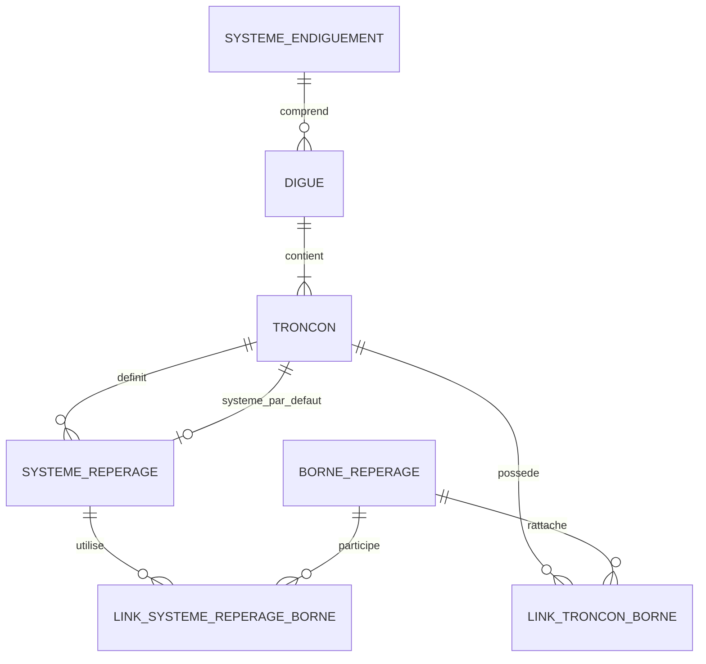
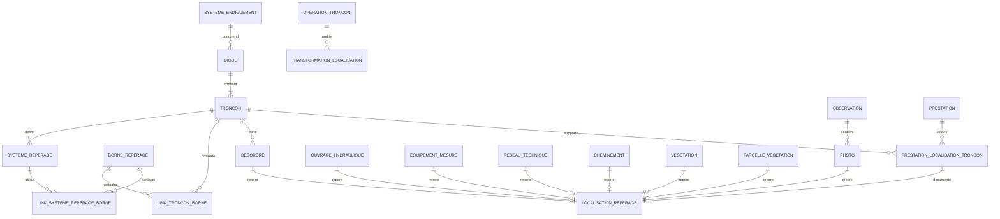

# SIRS — schéma conceptuel PostgreSQL/PostGIS

Version : **0.4 — 31 août 2026**  
Source : schéma conceptuel v0.3 + audit transversal du repérage linéaire SIRS + audit du référencement linéaire des prestations

## Objet de cette version

La v0.3 avait établi une distinction forte entre :

```text
objets physiques géolocalisés
→ geometry PostGIS comme référence spatiale

prestations linéaires
→ prestation_localisation_troncon
→ troncon_id + debut_m + fin_m
→ géométrie dérivée
```

L'audit transversal du repérage linéaire montre que cette distinction était trop restrictive.

Le système SIRS de repérage par système, bornes, distances, sens et PR n'est pas une particularité des prestations. Il est porté structurellement par la superclasse `Positionable`, utilisé par l'interface et les rapports, et effectivement renseigné pour plusieurs familles métier : désordres, photos, prestations, ouvrages hydrauliques, équipements de mesure, réseaux techniques, cheminements, mobilier, parcelles de végétation et certains objets de végétation.

La v0.4 adopte donc le principe suivant :

```text
géométrie PostGIS
= représentation cartographique

repérage linéaire
= information métier / terrain facultative et transversale

position brute de saisie
= information distincte lorsqu'elle existe
```

Ces représentations peuvent être cohérentes sans être interchangeables.

La v0.4 :

- réintroduit un noyau commun de systèmes et de bornes de repérage ;
- conserve le repérage comme sous-modèle facultatif pour les familles qui l'utilisent réellement ;
- ne rétablit pas le modèle `Positionable` de SIRS à l'identique ;
- conserve la géométrie PostGIS comme représentation cartographique des objets physiques ;
- conserve `prestation_localisation_troncon` comme localisation normalisée des prestations linéaires ;
- distingue explicitement géométrie, position brute, repérage terrain et trace source ;
- impose une politique d'autorité explicite lors des opérations de synchronisation ;
- corrige le modèle des photos afin qu'une localisation propre puisse être conservée indépendamment du parent ;
- prépare l'intégration QGIS sans imposer de parent polymorphe non contraignable.

---

## 1. Trois notions de localisation à distinguer

### 1.1 Géométrie cartographique

La géométrie PostGIS indique où l'objet est représenté sur la carte.

Pour un objet physique, elle peut être :

- un point relevé ou reconstruit ;
- une ligne ;
- un polygone ;
- une géométrie dérivée d'une autre donnée de référence.

Elle reste la représentation spatiale principale pour les objets physiques.

Exemples :

```text
desordre.geometry
ouvrage_hydraulique.geometry
equipement_mesure.geometry
cheminement.geometry
vegetation.geometry
photo.geometry éventuelle
```

### 1.2 Repérage terrain

Le repérage linéaire décrit l'objet dans un vocabulaire métier utilisable sur le terrain :

```text
tronçon
+ système de repérage
+ borne de référence
+ distance
+ sens
+ PR
```

Exemples d'usage :

```text
PR 3+420
20 m aval de la borne B12
intervalle PR 3+420 → 3+510
```

Cette information n'est pas remplacée par une géométrie XY.

### 1.3 Position brute de saisie

SIRS distingue également, pour de nombreux objets, `positionDebut` / `positionFin` et `geometry`.

Une position brute peut correspondre :

- à une coordonnée saisie ou relevée ;
- à une coordonnée située hors de l'axe du tronçon ;
- à une donnée utilisée ensuite pour recalculer PR, bornes et géométrie projetée.

Elle ne doit donc pas être assimilée automatiquement à la géométrie cartographique.

### 1.4 Règle générale

Le modèle cible ne doit jamais supposer implicitement :

```text
geometry = position brute = repérage linéaire
```

La synchronisation entre ces représentations doit être explicite et contrôlée.

---

## 2. Noyau commun de repérage

### 2.1 `systeme_reperage`

Concept : système définissant une échelle de PR sur un tronçon.

```text
systeme_reperage
- id
- troncon_id
- libelle
- commentaire
- valid
- traçabilité
```

Un système appartient à un tronçon.

Le modèle ne suppose pas :

- qu'un tronçon n'a qu'un seul système ;
- qu'un système ne possède que deux bornes ;
- que les PR commencent à zéro ;
- que les PR sont égaux aux mètres depuis le premier sommet ;
- que l'ordre de stockage des bornes définit le sens du système.

Un corpus audité peut présenter le cas simple d'un système élémentaire par tronçon et de deux bornes, mais cette particularité ne devient pas une règle générique.

### 2.2 `borne_reperage`

La borne est un objet de repérage ponctuel autonome.

```text
borne_reperage
- id
- libelle
- geometry Point
- fictive
- date_debut
- date_fin éventuelle
- valid
- traçabilité
```

Une borne peut génériquement être utilisée par plusieurs tronçons ou plusieurs systèmes.

La borne n'est donc pas assimilée à une extrémité de tronçon.

### 2.3 `link_troncon_borne`

La relation entre tronçons et bornes reste indépendante de l'utilisation de la borne dans un système particulier.

```text
link_troncon_borne
- troncon_id
- borne_id
```

Cette table permet de préserver le partage générique d'une borne.

### 2.4 `link_systeme_reperage_borne`

La valeur PR appartient à l'association entre un système et une borne.

```text
link_systeme_reperage_borne
- systeme_reperage_id
- borne_id
- valeur_pr
- ordre éventuel non autoritatif
- valid
```

Règle conceptuelle essentielle :

```text
valeur_pr
≠ propriété absolue de la borne

valeur_pr
= propriété de la borne dans un système de repérage donné
```

### 2.5 Système de repérage par défaut du tronçon

Le tronçon peut désigner un système par défaut :

```text
troncon.systeme_reperage_defaut_id
```

Cette FK est facultative.

Une contrainte doit garantir que le système désigné appartient au même tronçon.

---

## 3. `localisation_reperage`

### 3.1 Rôle

`localisation_reperage` représente facultativement le repérage linéaire d'un objet métier.

Elle ne remplace pas la géométrie de l'objet.

```text
localisation_reperage
- id
- troncon_id
- systeme_reperage_id

- borne_debut_id
- distance_debut_m
- sens_debut

- borne_fin_id
- distance_fin_m
- sens_fin

- pr_debut_source
- pr_fin_source

- position_debut_source
- position_fin_source

- mode_autorite
- qualite
- traçabilité source
```

La structure physique exacte reste à préciser, mais ces notions doivent pouvoir être représentées sans ambiguïté.

### 3.2 Sens des distances

Le booléen historique SIRS `borne_*_aval` est trop ambigu pour devenir tel quel une API durable.

Le modèle cible doit utiliser une valeur explicite, par exemple :

```text
BORNE_EN_AMONT_DU_POINT
BORNE_EN_AVAL_DU_POINT
```

ou toute convention équivalente clairement documentée.

### 3.3 PR source et PR courant

Le PR historique et le PR courant doivent être distingués.

```text
pr_debut_source / pr_fin_source
→ valeurs importées de SIRS

pr courant
→ valeur calculée à partir du système de repérage courant et de la localisation actuelle
```

Le modèle physique pourra choisir :

- un calcul à la demande ;
- une vue ;
- un cache explicitement versionné ou horodaté.

Il ne doit jamais écraser silencieusement le PR source par le PR recalculé.

### 3.4 Qualité

Une localisation peut être :

```text
VALIDE
INCOMPLETE
REFERENCE_ABSENTE
CONFLIT_TRONCON
CONFLIT_SYSTEME
HORS_TRONCON
TRACE_SOURCE
```

La liste exacte sera définie au dictionnaire physique.

Le principe est de permettre l'import de données historiques imparfaites sans fabriquer de fausses relations valides.

---

## 4. Politique d'autorité

Conserver plusieurs représentations n'est utile que si leur rôle est explicite.

Le modèle doit distinguer au minimum les politiques suivantes.

### 4.1 `GEOMETRIE_FIXE`

La position réelle cartographique reste fixe.

Lors d'une modification du tronçon :

```text
geometry / position brute conservée
→ PR et repérage recalculés
```

Cas typique : désordre levé sur le terrain ou objet physique dont la position XY fait foi.

### 4.2 `REPERAGE_FIXE`

Le repérage terrain reste fixe.

Lors d'une modification du tronçon ou des bornes :

```text
borne + distance + sens
→ nouvelle position / géométrie calculée
```

Ce mode n'est jamais appliqué implicitement à tous les objets.

### 4.3 `TRACE_SOURCE`

Les représentations historiques sont conservées sans synchronisation automatique.

Ce mode est utilisé notamment pour :

- référence cassée ;
- système incohérent avec le tronçon ;
- PR isolé ;
- ambiguïté impossible à résoudre automatiquement.

### 4.4 Prestations linéaires

Pour une prestation linéaire, la localisation courante reste portée par :

```text
prestation_localisation_troncon
→ troncon_id + troncon_entier + debut_m + fin_m
```

Le repérage SIRS associé est conservé comme donnée métier / terrain et comme trace d'origine.

Une politique explicite pourra autoriser une opération contrôlée à recalculer l'intervalle courant depuis un repérage déclaré fixe, mais le système ne doit pas maintenir silencieusement deux localisations concurrentes.

---

## 5. Patrimoine et repérage



Le noyau de repérage fait partie du patrimoine technique et métier du référentiel de tronçons.

Il n'est plus considéré comme une simple structure historique supprimable après migration.

---

## 6. Familles pouvant utiliser `localisation_reperage`

### 6.1 Conservation obligatoire ou fortement recommandée

Les familles suivantes doivent pouvoir référencer facultativement une localisation de repérage :

```text
desordre
photo
prestation / prestation_localisation_troncon
ouvrage_hydraulique
equipement_mesure
reseau_technique
cheminement
mobilier issu d'une classe positionnable
```

Cela ne signifie pas que chaque ligne possède obligatoirement un repérage.

### 6.2 Conservation conditionnelle

Le mécanisme doit également pouvoir être utilisé lorsque l'information est réellement présente pour :

```text
parcelle_vegetation
vegetation
TalusDigue et autres futures classes Positionable
```

La géométrie explicite reste prioritaire pour les objets surfaciques ou biologiques dont elle constitue la localisation principale.

### 6.3 Familles sans repérage propre

Le sous-modèle ne doit pas être ajouté artificiellement à :

```text
systeme_endiguement
digue
observation
amenagement_hydraulique
prestation_globale
plan_vegetation
CheminAccesDependance lorsqu'il n'en porte pas
classes plugin ne descendant pas de Positionable
```

---

## 7. Désordres

Le modèle v0.3 est corrigé.

Un désordre conserve :

```text
desordre
- id
- geometry
- attributs métier
- valid
- localisation_reperage_id nullable
```

Le rattachement métier à un ou plusieurs tronçons reste indépendant :

```text
link_desordre_troncon
```

Il faut distinguer :

```text
geometry
→ représentation cartographique du désordre

link_desordre_troncon
→ rattachement métier

localisation_reperage
→ lecture terrain / PR / bornes éventuelle

position_debut_source / position_fin_source
→ coordonnées brutes historiques si leur conservation est justifiée
```

Le PR ne doit pas être déduit puis présenté comme historique lorsque seule la géométrie est disponible.

---

## 8. Photos

### 8.1 Parent métier

Le principe de normalisation reste :

```text
objet métier
→ observation
→ photo
```

Une photo possède une observation parent dans le modèle cible.

### 8.2 Localisation propre

Le parent ne remplace pas la localisation propre de la photo.

Une photo peut donc conserver :

```text
photo
- id
- observation_id
- fichier / métadonnées
- geometry nullable
- localisation_reperage_id nullable
- traçabilité
```

La géométrie et le repérage de la photo sont indépendants de ceux de l'objet parent lorsqu'ils sont réellement renseignés dans la source.

La migration ne doit pas recopier automatiquement la localisation du parent vers la photo.

---

## 9. Prestations linéaires

### 9.1 Localisation normalisée courante

La décision v0.3 est conservée :

```text
prestation_localisation_troncon
- id
- prestation_id
- troncon_id
- troncon_entier
- debut_m
- fin_m
- localisation_reperage_id nullable
- traçabilité
```

Chaque ligne représente une portion d'un tronçon.

### 9.2 Tronçon entier

La représentation stable reste :

```text
troncon_entier = true
debut_m = NULL
fin_m = NULL
```

Elle signifie :

> La prestation couvre le tronçon courant dans sa totalité.

### 9.3 Portion de tronçon

```text
troncon_entier = false
debut_m IS NOT NULL
fin_m IS NOT NULL
0 <= debut_m <= fin_m <= longueur du tronçon
```

### 9.4 Conversion depuis SIRS

La migration ne copie jamais directement `prDebut` / `prFin` dans `debut_m` / `fin_m`.

La conversion générique recommandée reste :

1. résoudre le `linearId` explicite ;
2. privilégier les positions historiques ;
3. sinon reconstruire depuis borne + distance + sens ;
4. utiliser la géométrie historique seulement comme recours contrôlé ;
5. projeter le point sur le tronçon courant ;
6. convertir la fraction en distance métrique ;
7. comparer avec le système, les bornes et les PR ;
8. refuser ou classer en anomalie toute contradiction non résolue.

Les PR et bornes utilisés pour la conversion peuvent ensuite être conservés dans `localisation_reperage` au lieu d'être abandonnés.

### 9.5 Géométrie de prestation

La prestation linéaire ne possède toujours pas de `geometry_realisation` historique figée.

```text
troncon.geometry
+ troncon_entier / debut_m / fin_m
→ géométrie dérivée
```

Le repérage historique ne devient pas une seconde géométrie fonctionnelle.

---

## 10. Ouvrages, équipements, réseaux, cheminements et mobilier

Ces familles conservent leur géométrie PostGIS actuelle.

Elles peuvent en outre référencer une `localisation_reperage` facultative lorsqu'une chaîne réelle existe dans la source.

Exemple :

```text
ouvrage_hydraulique
- geometry
- rattachement tronçon
- localisation_reperage_id nullable
```

Le caractère ponctuel d'un objet ne rend pas son PR inutile :

```text
POINT
→ utile pour la carte

PR / borne / distance
→ utile pour la recherche, les rapports et le terrain
```

Les sous-types qui ne portent pas de repérage ne reçoivent aucune localisation artificielle.

---

## 11. Végétation et parcelles de gestion

### 11.1 Végétation

La géométrie explicite reste la représentation principale des objets de végétation.

Un repérage peut être conservé facultativement lorsqu'une chaîne cohérente existe.

Il ne doit pas remplacer :

```text
Point / Polygon / autre geometry valide
```

### 11.2 Parcelles de gestion

Les parcelles conservent :

```text
geometry
+ relations aux tronçons
```

Leurs PR historiques et chaînes de repérage peuvent avoir une valeur opérationnelle et doivent être conservables.

Une chaîne incomplète n'est pas transformée en localisation opérationnelle valide ; les valeurs sources restent traçables.

---

## 12. Évolution des tronçons

La v0.3 distinguait déjà correction géométrique et transformation conceptuelle. Cette distinction est conservée et étendue au repérage transversal.

### 12.1 Correction géométrique du même tronçon

L'effet dépend du mode d'autorité de chaque localisation :

```text
GEOMETRIE_FIXE
→ conserver le lieu cartographique
→ recalculer PR / bornes si demandé

REPERAGE_FIXE
→ conserver le repérage
→ recalculer la géométrie / position

TRACE_SOURCE
→ ne rien synchroniser automatiquement
→ conserver et signaler l'écart
```

Pour une prestation linéaire dont l'intervalle courant fait foi :

```text
troncon_id + debut_m + fin_m
→ conservés
→ géométrie dérivée recalculée
```

### 12.2 Inversion du tronçon

L'inversion reste une opération contrôlée.

Pour les intervalles métriques de prestations :

```text
nouveau_debut_m = L - ancien_fin_m
nouveau_fin_m   = L - ancien_debut_m
```

Les systèmes et bornes doivent également être revalidés :

- leur géométrie propre n'est pas inversée artificiellement ;
- l'échelle PR n'est pas recalculée par simple hypothèse ;
- le système par défaut et les associations borne-système doivent rester cohérents ;
- les localisations `REPERAGE_FIXE` sont recalculées selon le système après transformation ;
- les traces historiques ne sont pas écrasées.

### 12.3 Redécoupage

Le redécoupage doit transformer :

- les relations métier aux tronçons ;
- les intervalles `prestation_localisation_troncon` ;
- les systèmes de repérage concernés ;
- les appartenances tronçon-borne ;
- les localisations de repérage opérationnelles.

Aucune relation ne doit être recréée par simple proximité spatiale sans règle métier explicite.

### 12.4 Fusion

La fusion suit la même exigence : continuité, ordre, sens et transformation des dépendances doivent être démontrés.

Les systèmes de repérage sources ne sont pas fusionnés silencieusement en un nouveau système unique.

### 12.5 Remplacement

Un remplacement de tronçon change l'identité métier.

Il nécessite une correspondance explicite entre :

```text
tronçon(s) source(s)
→ tronçon(s) cible(s)
```

et le traitement contrôlé de toutes les localisations dépendantes.

---

## 13. Opérations contrôlées et audit

Le principe de la v0.3 est conservé :

```text
operation_troncon
- id
- type
- auteur
- date
- statut
- justification
- résultat de validation
```

avec relations vers les tronçons sources et cibles.

La v0.4 ajoute l'exigence que l'audit sache aussi établir :

- quels systèmes de repérage existaient avant l'opération ;
- quelles bornes et valeurs PR étaient concernées ;
- quelles localisations de repérage ont été recalculées ;
- quelle politique d'autorité a été appliquée ;
- quelles valeurs source ont été conservées ;
- quelles anomalies nécessitent encore une validation humaine.

---

## 14. Contraintes conceptuelles

### 14.1 Noyau

```text
systeme_reperage.troncon_id
→ obligatoire

troncon.systeme_reperage_defaut_id
→ NULL ou système du même tronçon

link_systeme_reperage_borne.valeur_pr
→ valeur du système, jamais propriété absolue de borne_reperage
```

### 14.2 Localisation de repérage opérationnelle

Lorsque la localisation est déclarée opérationnelle :

```text
systeme_reperage_id
→ système du tronçon de la localisation

borne_debut_id / borne_fin_id
→ bornes appartenant au système choisi

distance >= 0
sens explicite
```

Les cas historiques incohérents doivent pouvoir être conservés en `TRACE_SOURCE` sans FK mensongère.

### 14.3 Prestations

```text
troncon_entier = true
→ debut_m IS NULL
→ fin_m IS NULL

troncon_entier = false
→ debut_m IS NOT NULL
→ fin_m IS NOT NULL
→ debut_m >= 0
→ fin_m >= debut_m
→ fin_m <= longueur du tronçon courant
```

Aucune correction silencieuse n'est autorisée lorsqu'une modification du réseau invalide une mesure.

---

## 15. Migration depuis CouchDB

### 15.1 Noyau de repérage

La migration doit importer :

```text
TronconDigue.borneIds
SystemeReperage
SystemeReperageBorne
BorneDigue
TronconDigue.systemeRepDefautId
```

sans présumer que tous les systèmes ressemblent au cas élémentaire observé dans un corpus particulier.

### 15.2 Objets `Positionable`

Pour chaque famille :

1. déterminer si un repérage réellement renseigné existe ;
2. résoudre les références sans inventer de parent ;
3. conserver les chaînes cohérentes comme localisations opérationnelles ;
4. conserver les chaînes incohérentes en `TRACE_SOURCE` ;
5. ne pas transformer les valeurs numériques par défaut en fausses données métier ;
6. conserver séparément les valeurs historiques et les valeurs recalculées.

### 15.3 Pas de correction silencieuse

Sont interdits comme règles génériques de migration :

```text
nearest neighbour pour retrouver un tronçon
intersection spatiale utilisée comme FK sans validation
nom de digue / tronçon comme clé de correction
PR recopié comme distance métrique
ST_MakeValid ou projection utilisée pour masquer une contradiction métier
```

Les corrections spécifiques à une base source restent isolées dans le mécanisme d'override prévu par le migrateur et doivent être documentées.

---

## 16. QGIS

Le modèle doit permettre à QGIS d'exposer le repérage sans imposer la structure normalisée à l'utilisateur.

### 16.1 Vues métier

Des vues pourront exposer :

```text
objet
+ tronçon
+ système
+ borne début / fin
+ distance
+ sens
+ PR courant
+ PR source
+ qualité
+ mode d'autorité
```

### 16.2 Formulaires

Les formulaires QGIS pourront proposer :

```text
tronçon
→ système de repérage
→ borne
→ distance
→ sens
```

avec :

- valeurs filtrées par relation ;
- affichage du PR calculé ;
- avertissement en cas de trace historique incohérente ;
- action explicite de recalcul ;
- absence de synchronisation bidirectionnelle silencieuse.

### 16.3 Recherche et terrain

Le sous-modèle permet notamment :

- recherche par PR ;
- filtres par intervalle ;
- préparation de tournées ;
- affichage de libellés de type `PR 3+420` ;
- communication terrain en borne + distance ;
- conservation d'une lecture humaine même lorsque la géométrie est connue.

---

## 17. Vue d'ensemble v0.4



Ce diagramme est conceptuel. Il ne signifie pas qu'une table polymorphe porte directement `(objet_type, objet_id)`.

---

## 18. Stratégie relationnelle pour `localisation_reperage`

Une table polymorphe de la forme :

```text
localisation_reperage
- objet_type
- objet_id
```

est rejetée comme cible principale car elle empêcherait des FK PostgreSQL normales vers les différentes tables métier et compliquerait QGIS.

Deux stratégies physiques restent possibles.

### Option préférée

Une table commune :

```text
localisation_reperage
```

et une FK nullable depuis chaque table métier concernée :

```text
desordre.localisation_reperage_id
photo.localisation_reperage_id
ouvrage_hydraulique.localisation_reperage_id
...
```

Pour les prestations, la FK est portée par `prestation_localisation_troncon`.

### Alternative

Tables spécialisées :

```text
localisation_reperage_desordre
localisation_reperage_photo
localisation_reperage_ouvrage_hydraulique
...
```

Cette solution duplique davantage le schéma mais simplifie certaines contraintes et relations QGIS.

Le choix physique sera fait après prototypage QGIS.

---

## 19. Décisions désormais acquises

1. Le repérage linéaire SIRS n'est pas une exception propre aux prestations.
2. Un noyau commun `systeme_reperage` / `borne_reperage` doit être conservé.
3. La relation tronçon-borne est distincte de la relation système-borne.
4. `valeur_pr` appartient à l'association système-borne.
5. Un tronçon peut désigner un système de repérage par défaut.
6. Une localisation de repérage est facultative et transversale.
7. La géométrie PostGIS reste la représentation cartographique principale des objets physiques.
8. Une géométrie ne remplace pas automatiquement le PR, la borne, la distance et le sens métier.
9. Les positions brutes historiques peuvent être distinctes de la géométrie projetée et doivent pouvoir être conservées lorsque leur valeur est démontrée.
10. Les valeurs source et les valeurs recalculées ne doivent pas être écrasées l'une par l'autre.
11. Toute synchronisation doit connaître une politique d'autorité explicite.
12. `GEOMETRIE_FIXE`, `REPERAGE_FIXE` et `TRACE_SOURCE` constituent le minimum conceptuel de cette politique pour les objets physiques.
13. Les prestations conservent `prestation_localisation_troncon` comme localisation linéaire normalisée courante.
14. `prDebut` / `prFin` ne sont jamais copiés directement vers `debut_m` / `fin_m`.
15. La géométrie des prestations reste dérivée du tronçon courant ; aucune `geometry_realisation` figée n'est introduite.
16. Une photo peut posséder une localisation propre indépendante de son parent.
17. Les familles non `Positionable` ne reçoivent pas artificiellement de repérage.
18. Les anomalies historiques sont conservées comme traces plutôt que réparées silencieusement.
19. Les transformations structurantes de tronçons restent transactionnelles et auditables.
20. Une table propriétaire polymorphe `(objet_type, objet_id)` n'est pas la solution cible privilégiée.

---

## 20. Décisions encore ouvertes avant le dictionnaire physique

1. Choisir entre FK vers une table commune `localisation_reperage` et tables spécialisées par famille après prototype QGIS.
2. Définir les champs définitifs de `systeme_reperage` et `borne_reperage` à partir des données réellement utiles.
3. Définir la représentation physique du sens borne/point.
4. Définir si les PR courants sont calculés à la demande ou mis en cache.
5. Définir l'algorithme canonique PR ↔ position pour les systèmes non élémentaires.
6. Définir les règles exactes de mise à jour lorsque les bornes d'un système sont modifiées.
7. Définir si `mode_autorite` appartient à `localisation_reperage` ou à une règle métier plus générale de l'objet.
8. Définir l'exposition et l'édition des localisations dans QGIS et QField.
9. Définir la conservation physique des `positionDebut/Fin` source : colonnes dédiées ou trace de migration structurée.
10. Définir le modèle exact de géométrie propre des photos et sa migration.
11. Définir les anomalies de migration propres au repérage (`REFERENCE_ABSENTE`, `CONFLIT_TRONCON`, etc.).
12. Définir la stratégie de backfill des familles déjà migrées.
13. Déterminer les contraintes strictes applicables aux nouvelles saisies tout en acceptant l'historique imparfait.
14. Définir la politique d'archivage des systèmes et bornes après redécoupage, fusion ou remplacement.
15. Valider le comportement des prestations couvrant plusieurs tronçons et leur repérage historique associé.
16. Définir le traitement des classes `TalusDigue` et autres `Positionable` lorsqu'elles entreront dans le périmètre.

---

## 21. Ordre d'implémentation recommandé

La v0.4 implique de suspendre l'implémentation définitive des prestations tant que le noyau transversal n'existe pas.

Ordre recommandé :

```text
1. implémenter le noyau systeme_reperage / borne_reperage
2. migrer les 104 systèmes et 208 bornes du corpus de test
3. implémenter localisation_reperage + règles de qualité
4. backfiller une famille pilote, de préférence désordres
5. tester les formulaires et relations dans QGIS
6. traiter la localisation propre des photos
7. généraliser aux ouvrages / équipements / réseaux / cheminements
8. seulement ensuite implémenter les prestations et leur conversion debut_m / fin_m
9. traiter végétation / parcelles selon leur niveau réel de repérage
10. intégrer les opérations de transformation de tronçons
```

Cet ordre réduit le risque de devoir refondre une seconde fois la migration des prestations.

---

## Conclusion de la version 0.4

La v0.4 abandonne l'idée selon laquelle le référencement linéaire SIRS pourrait être supprimé presque partout dès lors qu'une géométrie PostGIS existe.

Le modèle cible distingue désormais :

```text
GEOMETRIE
→ où l'objet est représenté sur la carte

REPÉRAGE
→ comment l'objet est décrit et retrouvé sur le terrain

POSITION SOURCE
→ où l'utilisateur ou le système l'avait initialement placé

INTERVALLE DE PRESTATION
→ portion normalisée du tronçon utilisée pour la géométrie dérivée
```

Le but n'est pas de reproduire `Positionable` à l'identique. Le but est d'extraire de SIRS les concepts qui ont une valeur métier durable et de les rendre explicites dans PostgreSQL.

La conséquence principale est qu'un objet peut conserver sa géométrie PostGIS tout en possédant facultativement un repérage terrain par système, borne, distance, sens et PR.

Pour les prestations, `troncon_id + debut_m + fin_m` reste la localisation linéaire courante ; le repérage SIRS est conservé en parallèle comme information métier et historique, sans redevenir une géométrie figée ni un second mécanisme implicite de vérité.
