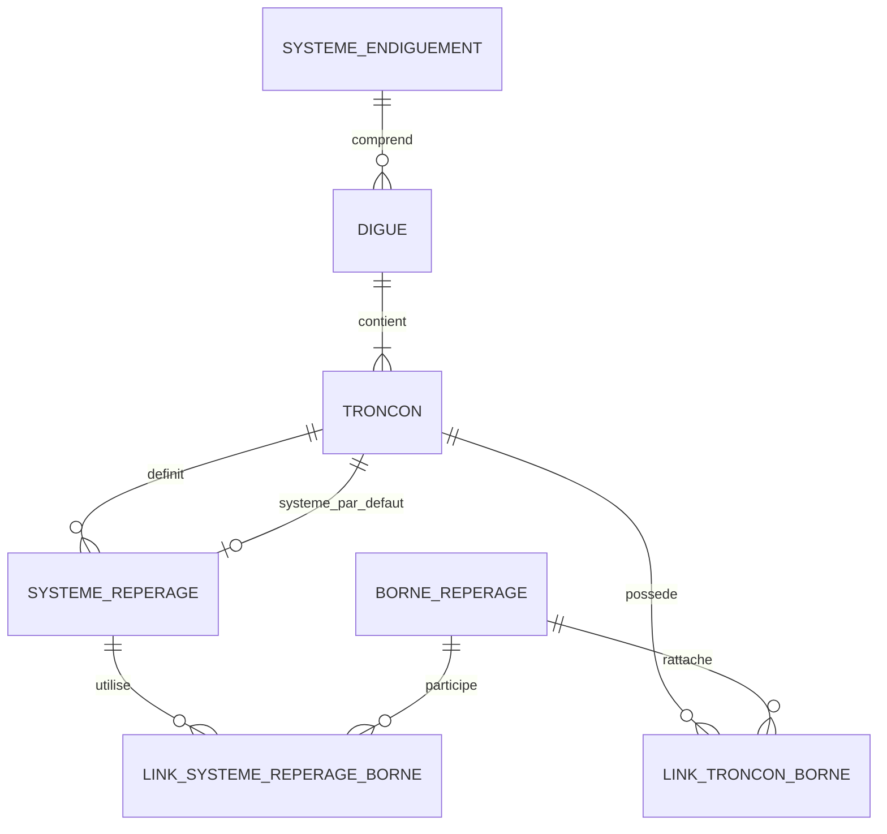
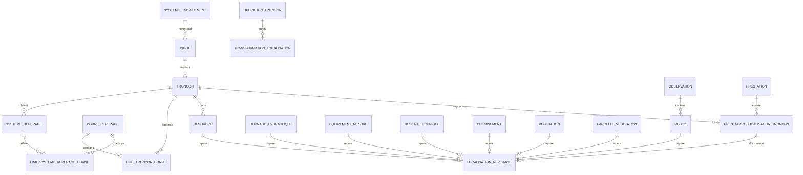

# SIRS — schéma conceptuel PostgreSQL/PostGIS

Version : **0.5 — 31 août 2026**  
Source : schéma conceptuel v0.4 + audit des conversions de repérage SIRS + audit transversal du repérage linéaire + audit du référencement linéaire des prestations

## Objet de cette version

La v0.3 avait établi une distinction forte entre :

```text
objets physiques géolocalisés
→ geometry PostGIS comme référence spatiale

prestations linéaires
→ prestation_localisation_troncon
→ troncon_id + debut_m + fin_m
→ géométrie dérivée
```

L'audit transversal du repérage linéaire montre que cette distinction était trop restrictive.

Le système SIRS de repérage par système, bornes, distances, sens et PR n'est pas une particularité des prestations. Il est porté structurellement par la superclasse `Positionable`, utilisé par l'interface et les rapports, et effectivement renseigné pour plusieurs familles métier : désordres, photos, prestations, ouvrages hydrauliques, équipements de mesure, réseaux techniques, cheminements, mobilier, parcelles de végétation et certains objets de végétation.

La v0.5 conserve cette architecture mais corrige un point conceptuel supplémentaire mis en évidence par l'audit des conversions SIRS.

SIRS mélange partiellement trois questions différentes :

```text
comment la donnée a été saisie ?
→ GPS / carte / XY / borne-distance / PR / import

quelle représentation décrit actuellement le lieu ?
→ position source / geometry / repérage / PR

quelle représentation doit rester stable quand le référentiel évolue ?
→ politique d'autorité durable
```

La traçabilité historique constitue encore un quatrième axe : elle décrit ce qui doit être conservé de la source, mais ne définit pas à elle seule une politique de mise à jour.

La v0.5 retient donc quatre notions indépendantes :

```text
REPRESENTATION
→ geometry / position source / repérage / PR

MODE DE SAISIE SOURCE
→ comment la localisation a été acquise

POLITIQUE D'AUTORITE
→ ce qui reste stable lors d'une évolution

TRACE SOURCE
→ valeurs historiques conservées sans écrasement
```

La v0.5 :

- conserve le noyau commun de systèmes et de bornes introduit en v0.4 ;
- conserve le repérage comme sous-modèle facultatif et transversal ;
- remplace `TRACE_SOURCE` comme politique d'autorité par une vraie séparation entre autorité et traçabilité ;
- introduit explicitement `mode_saisie_source` ;
- impose que toute conversion reçoive explicitement le système de repérage utilisé ;
- distingue PR source et PR courant, chacun rattaché explicitement à son système ;
- définit les trois conversions canoniques `XY → repérage`, `repérage → XY` et `PR → XY` ;
- interdit les rabattements, extrapolations et choix de système silencieux ;
- conserve `prestation_localisation_troncon` comme localisation normalisée des prestations linéaires ;
- ne reproduit ni `geometryMode` ni `editedGeoCoordinate` comme moteur d'autorité cible ;
- prépare une implémentation PostgreSQL/QGIS/QField déterministe et testable.

---

## 1. Trois notions de localisation à distinguer

### 1.1 Géométrie cartographique

La géométrie PostGIS indique où l'objet est représenté sur la carte.

Pour un objet physique, elle peut être :

- un point relevé ou reconstruit ;
- une ligne ;
- un polygone ;
- une géométrie dérivée d'une autre donnée de référence.

Elle reste la représentation spatiale principale pour les objets physiques.

Exemples :

```text
desordre.geometry
ouvrage_hydraulique.geometry
equipement_mesure.geometry
cheminement.geometry
vegetation.geometry
photo.geometry éventuelle
```

### 1.2 Repérage terrain

Le repérage linéaire décrit l'objet dans un vocabulaire métier utilisable sur le terrain :

```text
tronçon
+ système de repérage
+ borne de référence
+ distance
+ sens
+ PR
```

Exemples d'usage :

```text
PR 3+420
20 m aval de la borne B12
intervalle PR 3+420 → 3+510
```

Cette information n'est pas remplacée par une géométrie XY.

### 1.3 Position brute de saisie

SIRS distingue également, pour de nombreux objets, `positionDebut` / `positionFin` et `geometry`.

Une position brute peut correspondre :

- à une coordonnée saisie ou relevée ;
- à une coordonnée située hors de l'axe du tronçon ;
- à une donnée utilisée ensuite pour recalculer PR, bornes et géométrie projetée.

Elle ne doit donc pas être assimilée automatiquement à la géométrie cartographique.

### 1.4 Règle générale

Le modèle cible ne doit jamais supposer implicitement :

```text
geometry = position brute = repérage linéaire
```

La synchronisation entre ces représentations doit être explicite et contrôlée.

---

## 2. Noyau commun de repérage

### 2.1 `systeme_reperage`

Concept : système définissant une échelle de PR sur un tronçon.

```text
systeme_reperage
- id
- troncon_id
- libelle
- commentaire
- valid
- traçabilité
```

Un système appartient à un tronçon.

Le modèle ne suppose pas :

- qu'un tronçon n'a qu'un seul système ;
- qu'un système ne possède que deux bornes ;
- que les PR commencent à zéro ;
- que les PR sont égaux aux mètres depuis le premier sommet ;
- que l'ordre de stockage des bornes définit le sens du système.

Un corpus audité peut présenter le cas simple d'un système élémentaire par tronçon et de deux bornes, mais cette particularité ne devient pas une règle générique.

### 2.2 `borne_reperage`

La borne est un objet de repérage ponctuel autonome.

```text
borne_reperage
- id
- libelle
- geometry Point
- fictive
- date_debut
- date_fin éventuelle
- valid
- traçabilité
```

Une borne peut génériquement être utilisée par plusieurs tronçons ou plusieurs systèmes.

La borne n'est donc pas assimilée à une extrémité de tronçon.

### 2.3 `link_troncon_borne`

La relation entre tronçons et bornes reste indépendante de l'utilisation de la borne dans un système particulier.

```text
link_troncon_borne
- troncon_id
- borne_id
```

Cette table permet de préserver le partage générique d'une borne.

### 2.4 `link_systeme_reperage_borne`

La valeur PR appartient à l'association entre un système et une borne.

```text
link_systeme_reperage_borne
- systeme_reperage_id
- borne_id
- valeur_pr
- ordre éventuel non autoritatif
- valid
```

Règle conceptuelle essentielle :

```text
valeur_pr
≠ propriété absolue de la borne

valeur_pr
= propriété de la borne dans un système de repérage donné
```

### 2.5 Système de repérage par défaut du tronçon

Le tronçon peut désigner un système par défaut :

```text
troncon.systeme_reperage_defaut_id
```

Cette FK est facultative.

Une contrainte doit garantir que le système désigné appartient au même tronçon.

---

## 3. `localisation_reperage`

### 3.1 Rôle

`localisation_reperage` représente facultativement une localisation linéaire exprimée dans un tronçon et un système de repérage donnés.

Elle ne remplace ni la géométrie métier ni la position source.

Structure conceptuelle :

```text
localisation_reperage
- id
- troncon_id
- systeme_reperage_id

- borne_debut_id
- distance_debut_m
- sens_debut

- borne_fin_id
- distance_fin_m
- sens_fin

- position_debut_source
- position_fin_source
- crs_source éventuel

- pr_debut_source
- pr_fin_source
- systeme_reperage_source_id éventuel

- mode_saisie_source
- politique_autorite
- qualite
- traçabilité source
```

La structure physique exacte reste à préciser. En particulier, la cardinalité entre un objet métier et ses localisations de repérage reste ouverte pour ne pas empêcher les futurs cas multi-tronçons.

### 3.2 Système explicite

Toute localisation opérationnelle doit connaître explicitement son système :

```text
troncon_id
+ systeme_reperage_id
```

Le système par défaut du tronçon est une aide de sélection, pas une autorité cachée utilisée au milieu d'un calcul.

Une fonction de conversion ne doit jamais :

```text
recevoir un système A pour les bornes
puis utiliser silencieusement le système par défaut B pour le PR
```

Cette dissociation existe dans certains chemins SIRS historiques et ne doit pas être reproduite.

### 3.3 Sens des distances

Le booléen historique SIRS `borne_*_aval` n'est pas repris comme API cible.

Le modèle doit exprimer le rapport entre la borne et le point sans ambiguïté, par exemple :

```text
BORNE_EN_AMONT_DU_POINT
BORNE_EN_AVAL_DU_POINT
```

La convention algébrique doit être documentée indépendamment de l'orientation hydraulique :

```text
abscisse_objet
= abscisse_borne
+ distance_signee
```

Le sens du `LineString`, l'amont hydraulique et l'ordre des PR ne doivent jamais être assimilés implicitement.

### 3.4 Position source

`position_debut_source` / `position_fin_source` décrivent la coordonnée initialement saisie ou importée lorsqu'elle a une valeur métier.

Elles peuvent être hors de l'axe du tronçon.

Elles sont donc distinctes de :

```text
geometry
→ représentation cartographique actuelle

position_source
→ donnée brute ou historique d'acquisition
```

La position source ne doit pas être modifiée par une conversion courante.

### 3.5 PR source et PR courant

Le PR historique et le PR courant sont deux informations différentes.

```text
pr_debut_source / pr_fin_source
→ valeurs importées de SIRS
→ immuables en traçabilité

pr courant
→ valeur calculée dans un système explicitement identifié
```

Le PR courant doit toujours être accompagné du système dans lequel il est exprimé.

Le modèle physique pourra choisir entre :

- calcul à la demande ;
- vue SQL ;
- cache explicitement versionné ou horodaté.

Il ne doit jamais écraser silencieusement le PR source.

### 3.6 Mode de saisie source

Le modèle distingue la provenance de la localisation :

```text
mode_saisie_source
- GPS
- CARTE
- XY
- BORNE_DISTANCE
- PR
- IMPORT
- INCONNU
```

Cette information décrit comment la donnée a été acquise.

Elle ne détermine pas automatiquement la politique d'autorité future.

Ainsi :

```text
saisi par GPS
≠ obligatoirement GEOMETRIE_FIXE pour toujours

saisi par borne
≠ obligatoirement REPERAGE_FIXE pour toujours
```

### 3.7 Qualité et statut de conversion

Une localisation ou une conversion peut porter un statut explicite :

```text
OK
INCOMPLETE
REFERENCE_ABSENTE
CONFLIT_TRONCON
CONFLIT_SYSTEME
HORS_DOMAINE
SYSTEME_INCOMPLET
AMBIGU
```

Les cas historiques incohérents doivent pouvoir rester traçables sans fabriquer de fausses FK opérationnelles.

## 4. Politique d'autorité et traçabilité

La politique d'autorité répond à une seule question :

> Quelle représentation doit rester stable lorsqu'une opération modifie le référentiel ?

Elle est indépendante du mode de saisie historique.

### 4.1 `GEOMETRIE_FIXE`

Le lieu spatial de l'objet fait foi.

Lors d'une modification du tronçon :

```text
ancre spatiale conservée
→ nouvelle projection éventuelle
→ repérage courant recalculé dans le système explicitement choisi
```

L'ancre peut être la géométrie métier ou une position source validée selon la famille.

La trace historique n'est pas écrasée.

### 4.2 `REPERAGE_FIXE`

Le repérage terrain fait foi.

Lors d'une modification du tronçon ou d'une borne :

```text
système + borne + distance + sens
→ nouvelle abscisse
→ nouvelle position / géométrie calculée
→ PR courant recalculé dans le même système
```

Ce mode n'est jamais appliqué implicitement à tous les objets.

### 4.3 `MANUELLE`

Aucune synchronisation automatique ne doit décider à la place de l'utilisateur ou du processus métier.

Ce mode est adapté notamment à :

- références historiques contradictoires ;
- système incohérent avec le tronçon ;
- PR isolé ;
- cas multi-systèmes ambigus ;
- transformation de réseau nécessitant une validation humaine.

### 4.4 Trace source

La trace source n'est plus une valeur de `politique_autorite`.

Elle peut coexister avec n'importe quelle politique :

```text
GEOMETRIE_FIXE + trace source
REPERAGE_FIXE + trace source
MANUELLE + trace source
```

Les valeurs importées sont conservées comme faits historiques :

- système source ;
- bornes source ;
- distances et sens source ;
- PR source ;
- positions source ;
- mode SIRS historique éventuel ;
- identifiants CouchDB exacts.

`geometryMode` et `editedGeoCoordinate` peuvent être conservés comme trace d'import si nécessaire, mais ne pilotent aucune synchronisation cible.

### 4.5 Prestations linéaires

Pour une prestation linéaire, la localisation courante reste portée par :

```text
prestation_localisation_troncon
→ troncon_id + troncon_entier + debut_m + fin_m
```

Le repérage SIRS associé reste une information métier et historique distincte.

Une opération explicite pourra recalculer l'intervalle courant depuis un repérage déclaré autoritaire, mais le système ne maintient pas silencieusement deux localisations concurrentes.

## 5. Moteur canonique de conversion

Le modèle cible ne reproduit pas les synchronisations implicites de SIRS.

Il définit trois primitives déterministes. Toutes reçoivent explicitement le tronçon et le système utilisés.

### 5.1 XY → repérage

Entrées minimales :

```text
troncon_id
systeme_reperage_id
position XY
```

Algorithme conceptuel :

1. vérifier que le système appartient au tronçon ;
2. projeter la position sur `troncon.geometry` ;
3. calculer son abscisse curviligne ;
4. identifier, dans le système choisi, la borne dont l'abscisse projetée est la plus proche ;
5. calculer distance absolue et sens explicite ;
6. calculer le PR dans le même système ;
7. retourner la position projetée, le repérage et un statut de qualité.

Le tronçon n'est pas recherché automatiquement par proximité dans cette primitive.

Une interface peut proposer des candidats, mais le rattachement métier doit être validé explicitement.

### 5.2 Repérage → XY

Entrées minimales :

```text
troncon_id
systeme_reperage_id
borne_id
distance_m
sens
```

Algorithme conceptuel :

1. vérifier la cohérence tronçon / système / borne ;
2. projeter la borne sur le tronçon ;
3. calculer l'abscisse de la borne ;
4. appliquer la distance signée ;
5. vérifier si l'abscisse résultante est dans le domaine du tronçon ;
6. calculer le point XY ;
7. calculer le PR courant dans le même système ;
8. retourner un statut explicite.

Aucun rabattement silencieux sur le début ou la fin du tronçon n'est autorisé.

### 5.3 PR → XY

Entrées minimales :

```text
troncon_id
systeme_reperage_id
pr
```

Algorithme conceptuel :

1. vérifier la cohérence du système ;
2. rechercher les références de borne encadrant le PR par `valeur_pr` ;
3. projeter ces bornes sur le tronçon ;
4. interpoler l'abscisse curviligne entre elles ;
5. calculer le point XY ;
6. retourner le système effectivement utilisé et un statut.

Le modèle doit accepter :

- plus de deux bornes ;
- PR ne commençant pas à zéro ;
- PR décroissant dans le sens géométrique ;
- bornes intérieures au tronçon ;
- bornes éventuellement partagées.

Les PR dupliqués ou un système incomplet doivent produire un état `AMBIGU` ou `SYSTEME_INCOMPLET`, jamais dépendre de l'ordre de stockage.

### 5.4 Hors domaine

Les comportements hors domaine sont explicites.

Politique recommandée par défaut :

```text
REFUSER
```

Des opérations métier spécialisées peuvent demander explicitement :

```text
RABATTRE
EXTRAPOLER
```

mais cette décision appartient à l'appelant et doit être auditée.

### 5.5 Changement de système

Changer le système de repérage et déplacer l'objet sont deux opérations différentes.

Par défaut :

```text
lieu spatial conservé
→ calcul du repérage dans le nouveau système
```

Le changement de système ne doit pas modifier la géométrie par effet de bord.

Si l'utilisateur souhaite au contraire conserver borne + distance dans le nouveau système et déplacer l'objet, cela constitue une opération distincte et explicite.

### 5.6 Système par défaut

`troncons.systeme_reperage_defaut_id` sert à :

- préremplir un formulaire ;
- proposer un système lors d'une nouvelle saisie ;
- fournir une valeur par défaut explicite au niveau applicatif.

Les fonctions fondamentales de conversion n'utilisent pas ce système silencieusement.

Elles reçoivent toujours `systeme_reperage_id`.

## 6. Patrimoine et repérage



Le noyau de repérage fait partie du patrimoine technique et métier du référentiel de tronçons.

Il n'est plus considéré comme une simple structure historique supprimable après migration.

---

## 7. Familles pouvant utiliser `localisation_reperage`

### 7.1 Conservation obligatoire ou fortement recommandée

Les familles suivantes doivent pouvoir référencer facultativement une localisation de repérage :

```text
desordre
photo
prestation / prestation_localisation_troncon
ouvrage_hydraulique
equipement_mesure
reseau_technique
cheminement
mobilier issu d'une classe positionnable
```

Cela ne signifie pas que chaque ligne possède obligatoirement un repérage.

### 7.2 Conservation conditionnelle

Le mécanisme doit également pouvoir être utilisé lorsque l'information est réellement présente pour :

```text
parcelle_vegetation
vegetation
TalusDigue et autres futures classes Positionable
```

La géométrie explicite reste prioritaire pour les objets surfaciques ou biologiques dont elle constitue la localisation principale.

### 7.3 Familles sans repérage propre

Le sous-modèle ne doit pas être ajouté artificiellement à :

```text
systeme_endiguement
digue
observation
amenagement_hydraulique
prestation_globale
plan_vegetation
CheminAccesDependance lorsqu'il n'en porte pas
classes plugin ne descendant pas de Positionable
```

---

## 8. Désordres

Le modèle v0.3 est corrigé.

Un désordre conserve :

```text
desordre
- id
- geometry
- attributs métier
- valid
- localisation_reperage_id nullable
```

Le rattachement métier à un ou plusieurs tronçons reste indépendant :

```text
link_desordre_troncon
```

Il faut distinguer :

```text
geometry
→ représentation cartographique du désordre

link_desordre_troncon
→ rattachement métier

localisation_reperage
→ lecture terrain / PR / bornes éventuelle

position_debut_source / position_fin_source
→ coordonnées brutes historiques si leur conservation est justifiée
```

Le PR ne doit pas être déduit puis présenté comme historique lorsque seule la géométrie est disponible.

---

## 9. Photos

### 9.1 Parent métier

Le principe de normalisation reste :

```text
objet métier
→ observation
→ photo
```

Une photo possède une observation parent dans le modèle cible.

### 9.2 Localisation propre

Le parent ne remplace pas la localisation propre de la photo.

Une photo peut donc conserver :

```text
photo
- id
- observation_id
- fichier / métadonnées
- geometry nullable
- localisation_reperage_id nullable
- traçabilité
```

La géométrie et le repérage de la photo sont indépendants de ceux de l'objet parent lorsqu'ils sont réellement renseignés dans la source.

La migration ne doit pas recopier automatiquement la localisation du parent vers la photo.

---

## 10. Prestations linéaires

### 10.1 Localisation normalisée courante

La décision v0.3 est conservée :

```text
prestation_localisation_troncon
- id
- prestation_id
- troncon_id
- troncon_entier
- debut_m
- fin_m
- localisation_reperage_id nullable
- traçabilité
```

Chaque ligne représente une portion d'un tronçon.

### 10.2 Tronçon entier

La représentation stable reste :

```text
troncon_entier = true
debut_m = NULL
fin_m = NULL
```

Elle signifie :

> La prestation couvre le tronçon courant dans sa totalité.

### 10.3 Portion de tronçon

```text
troncon_entier = false
debut_m IS NOT NULL
fin_m IS NOT NULL
0 <= debut_m <= fin_m <= longueur du tronçon
```

### 10.4 Conversion depuis SIRS

La migration ne copie jamais directement `prDebut` / `prFin` dans `debut_m` / `fin_m`.

La conversion générique recommandée reste :

1. résoudre le `linearId` explicite ;
2. privilégier les positions historiques ;
3. sinon reconstruire depuis borne + distance + sens ;
4. utiliser la géométrie historique seulement comme recours contrôlé ;
5. projeter le point sur le tronçon courant ;
6. convertir la fraction en distance métrique ;
7. comparer avec le système, les bornes et les PR ;
8. refuser ou classer en anomalie toute contradiction non résolue.

Les PR et bornes utilisés pour la conversion peuvent ensuite être conservés dans `localisation_reperage` au lieu d'être abandonnés.

### 10.5 Géométrie de prestation

La prestation linéaire ne possède toujours pas de `geometry_realisation` historique figée.

```text
troncon.geometry
+ troncon_entier / debut_m / fin_m
→ géométrie dérivée
```

Le repérage historique ne devient pas une seconde géométrie fonctionnelle.

---

## 11. Ouvrages, équipements, réseaux, cheminements et mobilier

Ces familles conservent leur géométrie PostGIS actuelle.

Elles peuvent en outre référencer une `localisation_reperage` facultative lorsqu'une chaîne réelle existe dans la source.

Exemple :

```text
ouvrage_hydraulique
- geometry
- rattachement tronçon
- localisation_reperage_id nullable
```

Le caractère ponctuel d'un objet ne rend pas son PR inutile :

```text
POINT
→ utile pour la carte

PR / borne / distance
→ utile pour la recherche, les rapports et le terrain
```

Les sous-types qui ne portent pas de repérage ne reçoivent aucune localisation artificielle.

---

## 12. Végétation et parcelles de gestion

### 12.1 Végétation

La géométrie explicite reste la représentation principale des objets de végétation.

Un repérage peut être conservé facultativement lorsqu'une chaîne cohérente existe.

Il ne doit pas remplacer :

```text
Point / Polygon / autre geometry valide
```

### 12.2 Parcelles de gestion

Les parcelles conservent :

```text
geometry
+ relations aux tronçons
```

Leurs PR historiques et chaînes de repérage peuvent avoir une valeur opérationnelle et doivent être conservables.

Une chaîne incomplète n'est pas transformée en localisation opérationnelle valide ; les valeurs sources restent traçables.

---

## 13. Évolution des tronçons

La v0.3 distinguait déjà correction géométrique et transformation conceptuelle. Cette distinction est conservée et étendue au repérage transversal.

### 13.1 Correction géométrique du même tronçon

L'effet dépend de la politique d'autorité de chaque localisation :

```text
GEOMETRIE_FIXE
→ conserver le lieu spatial
→ recalculer le repérage courant dans un système explicite

REPERAGE_FIXE
→ conserver système + borne + distance + sens
→ recalculer la géométrie / position et le PR courant

MANUELLE
→ ne rien synchroniser automatiquement
→ conserver les représentations et demander une décision
```

La trace source reste conservée dans les trois cas.

Pour une prestation linéaire dont l'intervalle courant fait foi :

```text
troncon_id + debut_m + fin_m
→ conservés
→ géométrie dérivée recalculée
```

### 13.2 Inversion du tronçon

L'inversion reste une opération contrôlée.

Pour les intervalles métriques de prestations :

```text
nouveau_debut_m = L - ancien_fin_m
nouveau_fin_m   = L - ancien_debut_m
```

Les systèmes et bornes doivent également être revalidés :

- leur géométrie propre n'est pas inversée artificiellement ;
- l'échelle PR n'est pas recalculée par simple hypothèse ;
- le système par défaut et les associations borne-système doivent rester cohérents ;
- les localisations `REPERAGE_FIXE` sont recalculées selon le système après transformation ;
- les traces historiques ne sont pas écrasées.

### 13.3 Redécoupage

Le redécoupage doit transformer :

- les relations métier aux tronçons ;
- les intervalles `prestation_localisation_troncon` ;
- les systèmes de repérage concernés ;
- les appartenances tronçon-borne ;
- les localisations de repérage opérationnelles.

Aucune relation ne doit être recréée par simple proximité spatiale sans règle métier explicite.

### 13.4 Fusion

La fusion suit la même exigence : continuité, ordre, sens et transformation des dépendances doivent être démontrés.

Les systèmes de repérage sources ne sont pas fusionnés silencieusement en un nouveau système unique.

### 13.5 Remplacement

Un remplacement de tronçon change l'identité métier.

Il nécessite une correspondance explicite entre :

```text
tronçon(s) source(s)
→ tronçon(s) cible(s)
```

et le traitement contrôlé de toutes les localisations dépendantes.

---

## 14. Opérations contrôlées et audit

Le principe de la v0.3 est conservé :

```text
operation_troncon
- id
- type
- auteur
- date
- statut
- justification
- résultat de validation
```

avec relations vers les tronçons sources et cibles.

La v0.5 conserve et précise l'exigence que l'audit sache aussi établir :

- quels systèmes de repérage existaient avant l'opération ;
- quelles bornes et valeurs PR étaient concernées ;
- quelles localisations de repérage ont été recalculées ;
- quelle politique d'autorité a été appliquée ;
- quelles valeurs source ont été conservées ;
- quelles anomalies nécessitent encore une validation humaine.

---

## 15. Contraintes conceptuelles

### 15.1 Noyau

```text
systeme_reperage.troncon_id
→ obligatoire

troncon.systeme_reperage_defaut_id
→ NULL ou système du même tronçon

link_systeme_reperage_borne.valeur_pr
→ valeur du système, jamais propriété absolue de borne_reperage
```

### 15.2 Localisation de repérage opérationnelle

Lorsque la localisation est déclarée opérationnelle :

```text
systeme_reperage_id
→ système du tronçon de la localisation

borne_debut_id / borne_fin_id
→ bornes appartenant au système choisi

distance >= 0
sens explicite
```

Les cas historiques incohérents doivent pouvoir être conservés en traçabilité, avec `politique_autorite=MANUELLE` lorsqu’aucune synchronisation sûre n’est possible, sans FK mensongère.

### 15.3 Prestations

```text
troncon_entier = true
→ debut_m IS NULL
→ fin_m IS NULL

troncon_entier = false
→ debut_m IS NOT NULL
→ fin_m IS NOT NULL
→ debut_m >= 0
→ fin_m >= debut_m
→ fin_m <= longueur du tronçon courant
```

Aucune correction silencieuse n'est autorisée lorsqu'une modification du réseau invalide une mesure.

---

## 16. Migration depuis CouchDB

### 16.1 Noyau de repérage

La migration doit importer :

```text
TronconDigue.borneIds
SystemeReperage
SystemeReperageBorne
BorneDigue
TronconDigue.systemeRepDefautId
```

sans présumer que tous les systèmes ressemblent au cas élémentaire observé dans un corpus particulier.

### 16.2 Objets `Positionable`

Pour chaque famille :

1. déterminer si un repérage réellement renseigné existe ;
2. résoudre les références sans inventer de parent ;
3. conserver les chaînes cohérentes comme localisations opérationnelles ;
4. conserver les chaînes incohérentes en traçabilité et les classer `MANUELLE` lorsqu'aucune autorité sûre ne peut être établie ;
5. ne pas transformer les valeurs numériques par défaut en fausses données métier ;
6. conserver séparément les valeurs historiques et les valeurs recalculées.

### 16.3 Pas de correction silencieuse

Sont interdits comme règles génériques de migration :

```text
nearest neighbour pour retrouver un tronçon
intersection spatiale utilisée comme FK sans validation
nom de digue / tronçon comme clé de correction
PR recopié comme distance métrique
ST_MakeValid ou projection utilisée pour masquer une contradiction métier
```

Les corrections spécifiques à une base source restent isolées dans le mécanisme d'override prévu par le migrateur et doivent être documentées.

---

## 17. QGIS

Le modèle doit permettre à QGIS d'exposer le repérage sans imposer la structure normalisée à l'utilisateur.

### 17.1 Vues métier

Des vues pourront exposer :

```text
objet
+ tronçon
+ système courant
+ borne début / fin
+ distance
+ sens
+ PR courant et son système
+ PR source et son système
+ position source
+ mode de saisie source
+ qualité
+ politique d'autorité
```

### 17.2 Formulaires

Les formulaires QGIS pourront proposer :

```text
tronçon
→ système de repérage explicitement choisi
→ borne
→ distance
→ sens
```

avec :

- valeurs filtrées par relation ;
- affichage du PR calculé ;
- avertissement en cas de trace historique incohérente ;
- action explicite `XY → repérage` ;
- action explicite `repérage → XY` ;
- action explicite `PR → XY` lorsque pertinent ;
- choix visible de la politique d'autorité ;
- absence de synchronisation bidirectionnelle silencieuse.

### 17.3 Recherche et terrain

Le sous-modèle permet notamment :

- recherche par PR ;
- filtres par intervalle ;
- préparation de tournées ;
- affichage de libellés de type `PR 3+420` ;
- communication terrain en borne + distance ;
- conservation d'une lecture humaine même lorsque la géométrie est connue.

---

## 18. Vue d'ensemble v0.5



Ce diagramme est conceptuel. Il ne signifie pas qu'une table polymorphe porte directement `(objet_type, objet_id)`.

---

## 19. Stratégie relationnelle pour `localisation_reperage`

Une table polymorphe de la forme :

```text
localisation_reperage
- objet_type
- objet_id
```

est rejetée comme cible principale car elle empêcherait des FK PostgreSQL normales vers les différentes tables métier et compliquerait QGIS.

Deux stratégies physiques restent possibles.

### Option préférée

Une table commune :

```text
localisation_reperage
```

et une FK nullable depuis chaque table métier concernée :

```text
desordre.localisation_reperage_id
photo.localisation_reperage_id
ouvrage_hydraulique.localisation_reperage_id
...
```

Pour les prestations, la FK est portée par `prestation_localisation_troncon`.

### Alternative

Tables spécialisées :

```text
localisation_reperage_desordre
localisation_reperage_photo
localisation_reperage_ouvrage_hydraulique
...
```

Cette solution duplique davantage le schéma mais simplifie certaines contraintes et relations QGIS.

Le choix physique sera fait après prototypage QGIS.

---

## 20. Décisions désormais acquises

1. Le repérage linéaire SIRS n'est pas une exception propre aux prestations.
2. Un noyau commun `systemes_reperage` / `bornes_reperage` doit être conservé.
3. La relation tronçon-borne est distincte de la relation système-borne.
4. `valeur_pr` appartient à l'association système-borne.
5. Un tronçon peut désigner un système de repérage par défaut.
6. Le système par défaut est une aide de sélection, pas une autorité cachée de conversion.
7. Une localisation de repérage est facultative et transversale.
8. La géométrie PostGIS reste la représentation cartographique principale des objets physiques.
9. Une géométrie ne remplace pas automatiquement le PR, la borne, la distance et le sens métier.
10. Les positions source peuvent être distinctes de la géométrie projetée et doivent pouvoir être conservées.
11. `mode_saisie_source` et `politique_autorite` sont deux notions indépendantes.
12. `TRACE_SOURCE` n'est plus une politique d'autorité.
13. Les politiques d'autorité minimales sont `GEOMETRIE_FIXE`, `REPERAGE_FIXE` et `MANUELLE`.
14. La trace source peut coexister avec n'importe quelle politique d'autorité.
15. Toute conversion canonique reçoit explicitement `systeme_reperage_id`.
16. PR source et PR courant sont distincts et doivent identifier leur système.
17. Les conversions canoniques sont `XY → repérage`, `repérage → XY` et `PR → XY`.
18. Un cas hors domaine ou ambigu doit produire un statut explicite, pas un rabattement ou une extrapolation silencieuse.
19. Changer de système de repérage ne signifie pas déplacer l'objet.
20. `geometryMode` et `editedGeoCoordinate` ne pilotent pas le modèle cible ; ils ne valent au plus que comme trace d'import.
21. Les prestations conservent `prestation_localisation_troncon` comme localisation linéaire normalisée courante.
22. `prDebut` / `prFin` ne sont jamais copiés directement vers `debut_m` / `fin_m`.
23. La géométrie des prestations reste dérivée du tronçon courant ; aucune `geometry_realisation` figée n'est introduite.
24. Une photo peut posséder une localisation propre indépendante de son parent.
25. Les familles non `Positionable` ne reçoivent pas artificiellement de repérage.
26. Les anomalies historiques sont conservées comme traces plutôt que réparées silencieusement.
27. Les transformations structurantes de tronçons restent transactionnelles et auditables.
28. Une table propriétaire polymorphe `(objet_type, objet_id)` n'est pas la solution cible privilégiée.

## 21. Décisions encore ouvertes avant le dictionnaire physique

1. Choisir la cardinalité physique entre objets métier et `localisation_reperage`, notamment pour ne pas bloquer les futurs cas multi-tronçons.
2. Choisir entre FK vers une table commune, tables de liens typées ou tables spécialisées par famille après prototype QGIS/QField.
3. Définir la représentation physique exacte du sens borne/point.
4. Définir si le PR courant est toujours calculé à la demande ou parfois mis en cache.
5. Définir la fonction SQL/PostGIS canonique d'interpolation PR pour les systèmes non élémentaires.
6. Définir le traitement exact des PR dupliqués et des systèmes incomplets.
7. Définir les politiques autorisées hors domaine (`REFUSER`, `RABATTRE`, `EXTRAPOLER`) selon les opérations.
8. Définir les règles de mise à jour lorsqu'une borne est déplacée ou qu'une `valeur_pr` change.
9. Définir si `politique_autorite` appartient directement à `localisation_reperage` ou à une couche de règle métier plus générale.
10. Définir l'exposition et l'édition des localisations dans QGIS et QField.
11. Définir la conservation physique des positions source : colonnes dédiées, table annexe ou trace structurée.
12. Définir le modèle exact de géométrie propre des photos et sa migration.
13. Définir les anomalies propres au moteur de conversion (`HORS_DOMAINE`, `SYSTEME_INCOMPLET`, `AMBIGU`, etc.).
14. Définir la stratégie de backfill des familles déjà migrées.
15. Déterminer les contraintes strictes applicables aux nouvelles saisies tout en acceptant l'historique imparfait.
16. Définir la politique d'archivage des systèmes et bornes après redécoupage, fusion ou remplacement.
17. Valider le comportement des prestations couvrant plusieurs tronçons et leur repérage historique associé.
18. Définir le traitement des classes `TalusDigue` et autres `Positionable` lorsqu'elles entreront dans le périmètre.
19. Déterminer si une opération de changement de système doit conserver systématiquement le lieu spatial ou proposer explicitement plusieurs stratégies.
20. Prototyper dans QGIS/QField la saisie `XY → repérage` et `borne-distance → XY` avant de figer les widgets de formulaire.

## 22. Ordre d'implémentation recommandé

Le noyau `systemes_reperage` / `bornes_reperage` constitue désormais le premier lot implémenté.

Ordre recommandé à partir de la v0.5 :

```text
1. noyau systemes_reperage / bornes_reperage
   → implémenté et validé

2. fonctions déterministes de conversion
   → XY → repérage
   → repérage → XY
   → PR → XY
   → statuts d'erreur explicites
   → aucune sélection silencieuse du système

3. implémenter localisation_reperage
   → mode_saisie_source
   → politique_autorite
   → trace source distincte
   → qualité

4. backfiller une famille pilote : désordres
   → conserver position source
   → conserver PR source
   → calculer repérage courant contrôlé
   → comparer source / courant

5. tester les formulaires et relations dans QGIS/QField
   → système explicite
   → actions de conversion visibles
   → pas de dépendance à Python pour la logique métier fondamentale

6. traiter la localisation propre des photos

7. généraliser aux ouvrages / équipements / réseaux / cheminements

8. implémenter les prestations
   → prestation_localisation_troncon
   → conversion contrôlée vers debut_m / fin_m
   → repérage historique conservé séparément

9. traiter végétation / parcelles selon leur niveau réel de repérage

10. intégrer les opérations de transformation de tronçons
    → politique d'autorité explicite
    → audit transactionnel
```

Cet ordre évite de figer `localisation_reperage` avant d'avoir stabilisé les fonctions de conversion qui lui donnent son sens.

## Conclusion de la version 0.5

La v0.5 conserve le repérage transversal introduit en v0.4, mais sépare désormais explicitement quatre dimensions :

```text
REPRESENTATION
→ où et comment la localisation est exprimée

MODE DE SAISIE SOURCE
→ comment elle a été acquise

POLITIQUE D'AUTORITE
→ ce qui doit rester stable lorsque le référentiel évolue

TRACE SOURCE
→ ce qui doit rester historiquement consultable
```

Cette séparation corrige une faiblesse du modèle SIRS historique : `geometryMode`, `editedGeoCoordinate`, `systemeRepId`, le système par défaut et les PR ne formaient pas une source de vérité unique et pouvaient être mis à jour par des chemins différents.

Le modèle cible ne reproduit donc pas les priorités implicites de SIRS.

Il retient au contraire trois conversions déterministes :

```text
XY + tronçon + système
→ repérage

repérage + tronçon + système
→ XY

PR + tronçon + système
→ XY
```

Le système utilisé est toujours explicite. Les cas ambigus ou hors domaine sont signalés. Le changement de système est distingué d'un déplacement physique.

Pour les objets physiques, `geometry` reste la représentation cartographique courante ; la position source peut être conservée séparément ; le repérage terrain reste disponible lorsqu'il existe.

Pour les prestations, `troncon_id + troncon_entier + debut_m + fin_m` reste la localisation linéaire normalisée courante. Le repérage SIRS reste une information métier et historique distincte.

La conséquence pratique de la v0.5 est que le prochain lot ne doit pas encore commencer par le backfill massif des objets. Il doit d'abord stabiliser les fonctions PostgreSQL/PostGIS de conversion et leurs statuts d'erreur, puis appliquer `localisation_reperage` aux désordres comme famille pilote.
